#+title: Funktioner og intro til infinitesimalregning
#+subtitle: Matematik
#+author: Jacob Debel
#+date: 
# Themes: beige|black|blood|league|moon|night|serif|simple|sky|solarized|white
#+reveal_theme: night
#+reveal_title_slide: <h2>%t</h2><h3>%s</h3><h4>%a</h4><h4>%d</h4>
#+reveal_title_slide_background:
#+reveal_default_slide_background:
#+reveal_extra_options: slideNumber:"c",progress:true,transition:"slide",navigationMode:"default",history:false,hash:true
# #+reveal_extra_attr: style="color:red"
#+options: toc:nil num:nil tags:nil timestamp:nil ^:{}

* Hvad vi skal
#+reveal_html: 

- Intro til funktioner generelt
- Intro til afledte funktioner (differentiation) og funktioners hældninger
- Intro til stamfunktioner/antiafledte (integration) og arealer under grafer
- Intro til funktionstyper, deres afledte funktioner og deres stamfunktioner
- Arbejde med matematikprojekt skatepark.
- Vi går mere i deltalje med differentiation og integration i senere forløb
#+reveal_html: 

* Funktioner generelt

** Sammenhæng mellem variable
#+reveal_html: 

I kender det allerede:
#+attr_reveal: :frag (appear)
- Regningen på energidrik afhænger af antallet af energidrik, der købes (og mærket selvfølgelig).
- Renteindtægterne i banken afhænger af pengene på bankbogen.
- Tidevand afhænger af tidspunktet på døgnet.

#+reveal_html: 

#+reveal: split
#+reveal_html: 

Fælles er:
#+attr_reveal: :frag (appear)
- at en størrelse afhænger af en anden.
- men at den anden størrelse ikke afhænger af den første.

#+attr_reveal: :frag (appear)
Eksempel
#+attr_reveal: :frag (appear)
- Der er ikke både flod og ebbe (høj- og lavvande) på samme tid.
- Vi betaler ikke to forskellige beløb for det samme antal mælk (af samme mærke og i samme butik).
#+reveal_html: 

** To variabeltyper
- Den *uafhængige* variabel
  - Den I før har kaldt x.
  - Værdierne kan vælges "frit".
- Den *afhængige* variabel
  - Den I før har kaldt y og nu kommer til at kalde $f(x)$.
  - Værdien /afhænger/ af, hvad den uafhængige værdi.

    
** Parsammenligning
*Find selv på eksempler, hvor en størrelse afhænger af en anden.*
- Først i makkerpar.
- Del jeres eksempler i makkerskabsgruppen.

** Funktionsbegrebet
#+reveal_html: 

I matematik er en /funktion/ en matematisk sammenhæng mellem to størrelser.

#+begin_quote
En funktion forstås som en beskrivelse af sammenhængen mellem en uafhængig variabelskift $x$ og en afhængig variabel $f(x)$.

Det gælder, at der til én værdi af den uafhængige variabel $x$ kun findes én værdi af den afhængige variabel $f(x)$.
#+end_quote
#+reveal_html: 

** Repræsentationsformer
#+reveal_html: 

Typisk beskrives en matematisk funktion ved en *forskrift* og/eller en *graf*.

#+reveal_html: 

#+reveal_html: 

Forskrifter:
\begin{align*}
f(x)&= \frac{1}{2}x -3 \\
g(x)&= 2 e^{-\frac{1}{2}x} \\
h(x) &= \sqrt{x} \\
i(x) &= - \frac{1}{x}+3
\end{align*}

Hvad skal det sige inde i hovedet?
#+reveal_html: 

#+reveal_html: 

De tilhørende grafer:

#+attr_html: :width 600px
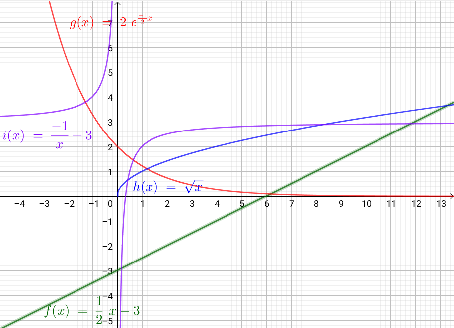
#+reveal_html: 

#+reveal_html: 

#+reveal_html: 

** Opgave 7.1.4
#+reveal_html: 

Diskutér i makkerpar.

#+DOWNLOADED: screenshot @ 2022-01-23 21:03:40
#+attr_html: :height 500px
#+attr_latex: :width 7cm
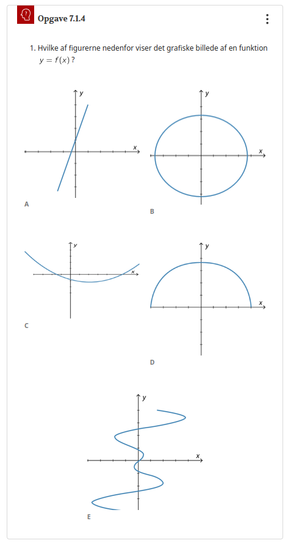
#+reveal_html: 

** Opgave 7.1.1 og 7.1.2
#+attr_html: :height 500px
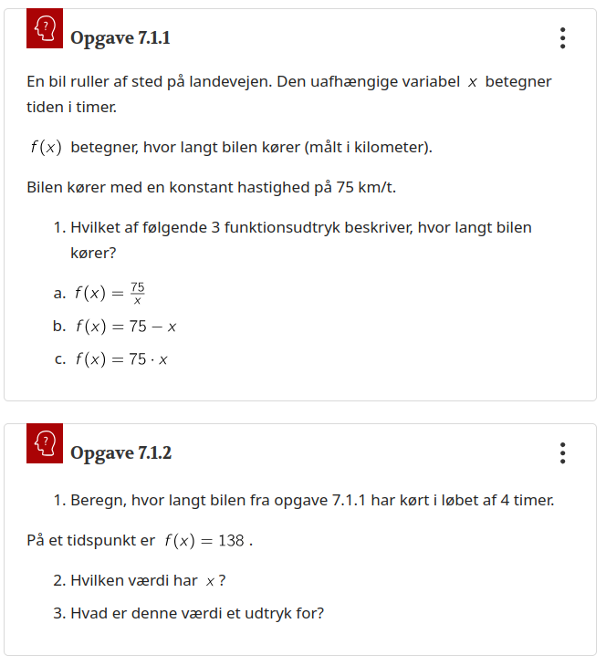

** DM og VM
#+reveal_html: 

Nej, der er hverken tale om Danmarks- eller verdensmesterskabet her.

- DM /Definitionsmængde/ :: Mængden af tal, der kan anvendes som uafhængig variabel, typisk $x$ i en funktion.

- VM /Værdimængde/ :: Mængden af funktionsværdier, typisk $f(x)$, der fremkommer ved gennemløb af definitionsmængden.
#+reveal_html: 

** DM og VM
#+reveal_html: 

Det skrives på en helt særlig måde.

#+reveal_html: 

#+reveal_html: 

\begin{align*}
Dm(f) &= \left\{ x \in \mathbb{R} \right\} \\
Vm(f) &= \left\{ f \in \mathbb{R} \right\} \\
\\
Dm(g) &= \left\{ x \in \mathbb{R} \right\} \\
Vm(g) &= \left\{ g \in \mathbb{R} | g > 0 \right\} = \left\{ g \in \mathbb{R}_+^{*} \right\}\\
\\
Dm(h) &= \left\{ x \in \mathbb{R} | x \geq 0 \right\} = \left\{ x \in \mathbb{R}_+ \right\}\\
Vm(h) &= \left\{ h \in \mathbb{R} | h \geq 0 \right\} = \left\{ h \in \mathbb{R}_+ \right\}\\
\\
Dm(i) &= \left\{ x \in \mathbb{R} | x \neq 0 \right\} = \left\{ x \in \mathbb{R}\setminus \{0\} \right\}\\
Vm(i) &= \left\{ i \in \mathbb{R} | i \neq 3 \right\} = \left\{ i \in \mathbb{R}\setminus \{3\} \right\}
\end{align*}

#+attr_reveal: :frag (appear)
Gad vide, hvad det siger inde i hovedet? :)
#+reveal_html: 

#+reveal_html: 

Graferne fra tidligere
#+attr_html: :width 600px

#+reveal_html: 

#+reveal_html: 

#+reveal_html: 

** Opgave 7.1.5 og 7.1.6
#+reveal_html: 

#+reveal_html: 

#+reveal_html: 

- Note 7.1.5: Kan I se, at der er forskel på "bollerne" i enderne af graferne? Der er en lille forskel i deres betydning.
- Ekstra udfordring til opgave 7.1.6: Bestem Dm og Vm /uden/ at tegne graferne først.
#+reveal_html: 

#+reveal_html: 

#+attr_html: :height 500px
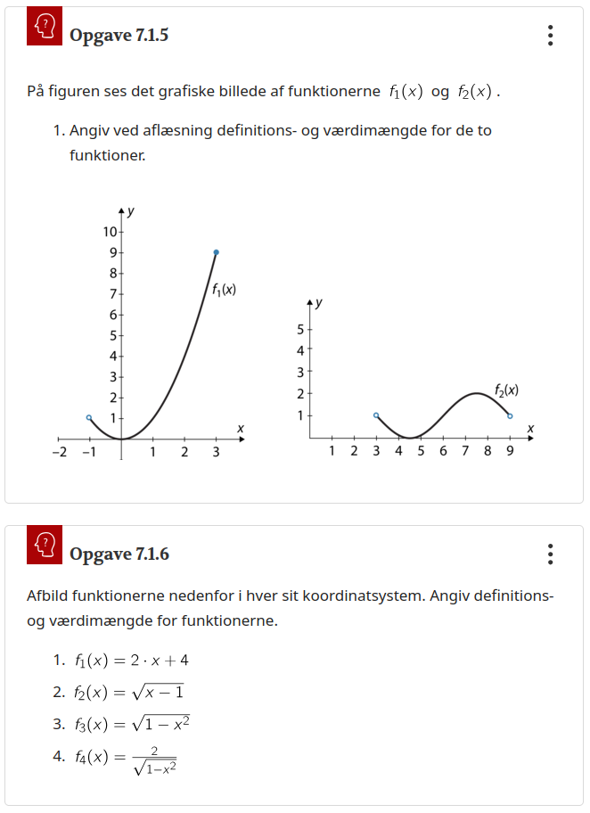
#+reveal_html: 

#+reveal_html: 

#+reveal_html: 

** Monotoniforhold
#+reveal_html: 

#+reveal_html: 

#+reveal_html: 

- Når noget er monotont, er det ensformigt.
- En funktion er monoton, når den er voksende eller aftagende i hele sin Dm.
- En funktion, som hverken vokser eller aftager, er konstant.
- En funktion kan skifte mellem at være voksende og aftagende. Man fastlægger dens /monotoniforhold/.

#+begin_quote
- f er voksende i et interval, hvis $x_1 < x_2 \Rightarrow f(x_1) < f(x_2)$ eller $f'(x) > 0$
- f er aftagende i et interval, hvis $x_1 < x_2 \Rightarrow f(x_1) > f(x_2)$ eller $f'(x) < 0$
- f er konstant, hvis $f(x) = k$ i hele Dm.
#+end_quote
- Læg mærke til apostroffen. Mere om det under differentialregning.
#+reveal_html: 

#+reveal_html: 

#+attr_html: :height 120px
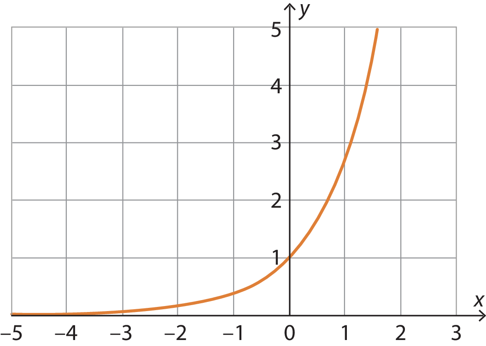
#+attr_html: :height 120px
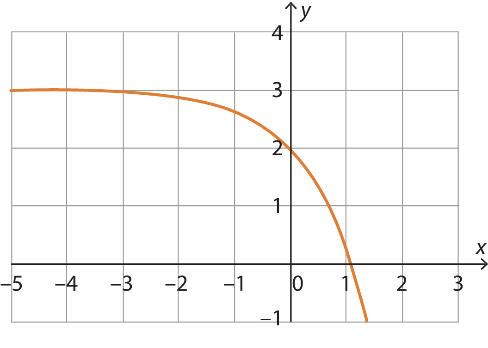
#+attr_html: :height 120px
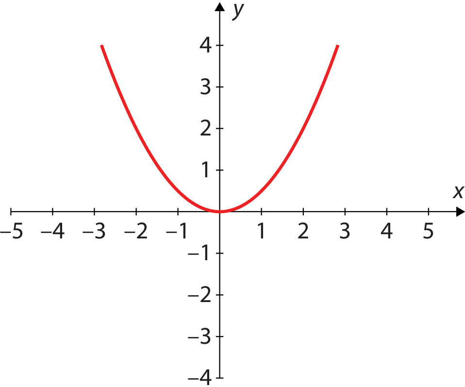
#+reveal_html: 

#+reveal_html: 

#+reveal_html: 

** Ekstremumspunkter
#+reveal_html: 

#+reveal_html: 

#+reveal_html: 

- Et ekstremumspunkt er enten er minimumspunkt eller et maksimumspunkt.
- Hedder også et ekstremum i ental og ekstrama i flertal.
- Der er både /globale/ og /lokale/ ekstremumspunkter.
#+reveal_html: 

#+reveal_html: 

#+attr_html: :width 300px
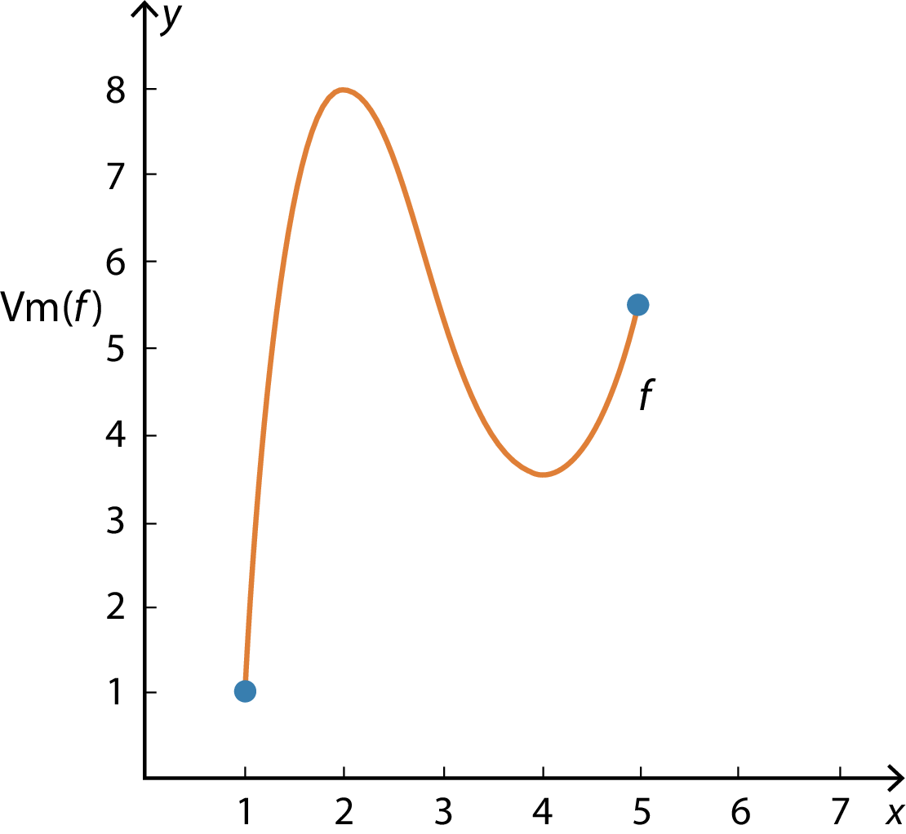
#+reveal_html: 

#+reveal_html: 

#+reveal_html: 

** Ekstremumspunkter
#+reveal_html: 

Eksempel 7.1.6.1

#+reveal_html: 

#+reveal_html: 

- Lokalt og globalt minimum: $(3\,,\, -13.5)$
- Lokalt maksimum: $(-2\,,\,7.33)$
- Globalt maksimum: $(6\,,\,18)$
- Funktionens monotoniforhold:
  - $f$ er voksende i intervallerne $-3 \leq x < -2$ og $3< x \leq 6$
  - $f$ er aftagende  i intervallet $-2 < x < 3$
- $Vm(f) = \left\{ f \in \mathbb{R} | -13.5 \leq f \leq 18 \right\}$
#+reveal_html: 

#+reveal_html: 

\begin{align*}
f(x)&= \frac{1}{3} x^3-\frac{1}{2}x^2-6x \\
Dm(f) &= \left\{ x \in \mathbb{R} | -3 \leq x \leq 6 \right\}
\end{align*}
#+attr_html: :width 500px
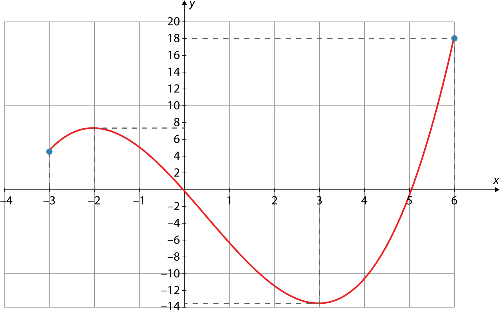
#+reveal_html: 

#+reveal_html: 

#+reveal_html: 

** Opgave 7.1.8 og 7.1.9
#+reveal_html: 

#+reveal_html: 

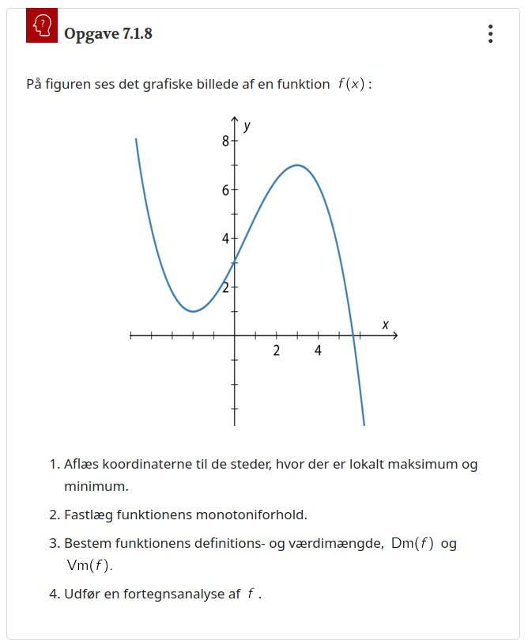
#+reveal_html: 

#+reveal_html: 

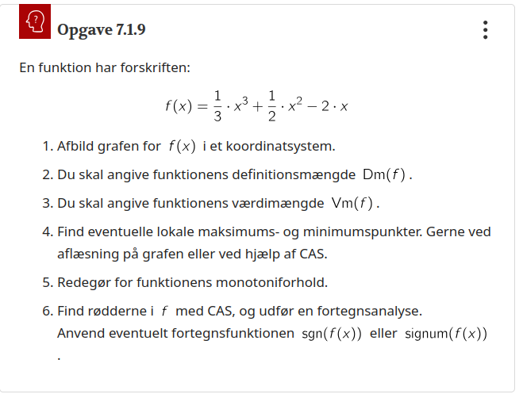
#+reveal_html: 

#+reveal_html: 

#+reveal_html: 

#+DOWNLOADED: screenshot @ 2022-01-24 09:47:44
#+attr_html: :width 600px
#+attr_latex: :width 7cm
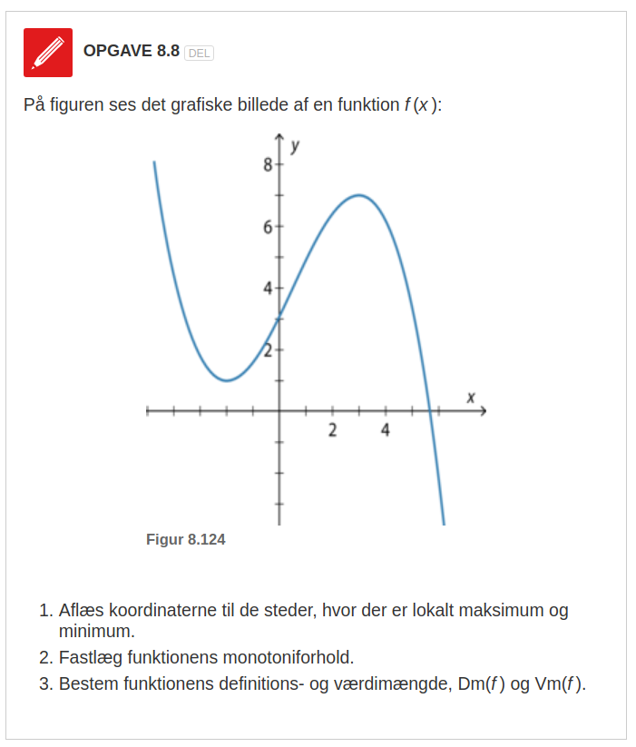
#+reveal_html: 

#+reveal_html: 

#+DOWNLOADED: screenshot @ 2022-01-24 09:47:56
#+attr_html: :width 600px
#+attr_latex: :width 7cm
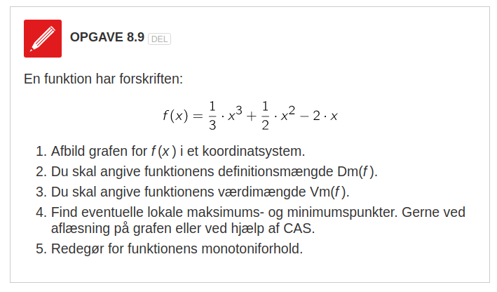
#+reveal_html: 

* Intro til differentiation
Det hele omhandler *hældninger*!
#+attr_html: :width 500px
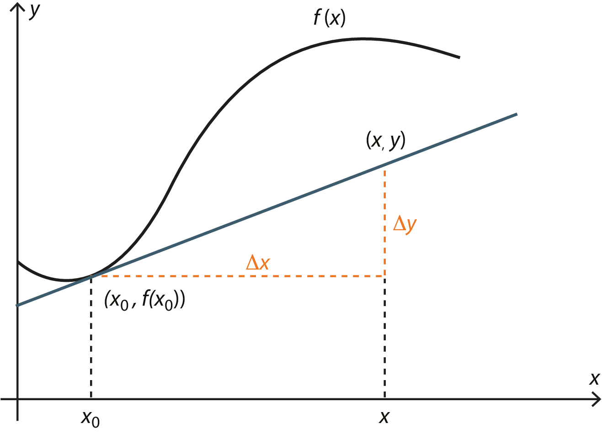

#+reveal: split
#+reveal_html: 

- Afledt funktion: $f'(x)$ - En funktion for en funktions hældningstal
- Tangentligninger
- Funktionsanalyse:
  - Maksimum og minimum (ekstremumspunkter)
  - Vendetangentpunkter
  - Monotoniforhold
- Optimering
#+reveal_html: 

** Hældningen for en funktion
#+reveal_html: 

#+reveal_html: 

#+reveal_html: 

- I ét punkt på en graf, har grafen samme hældning som /tangenten/.
- Hældningen ændrer sig som funktion af x.
- Men, hvordan gør den det (altså hældningen)?
#+reveal_html: 

#+reveal_html: 

#+attr_html: :width 600px
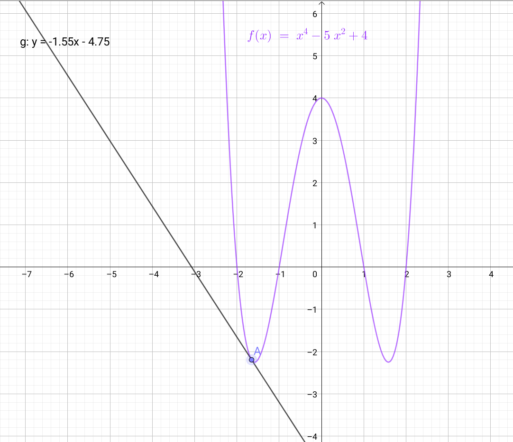
#+reveal_html: 

#+reveal_html: 

#+reveal_html: 

# ** TEST embedded geogebra

# #+begin_export html
# <embed
# width="500"
# height="800"
# src="./ggb/intro_til_diff.html"
# title="Introduktion til differentialregning"
# frameborder="0">
# </embed>
# #+end_export
** Opgave - undersøgelse af hældninger
#+reveal_html: 

I skal undesøge hældningerne for forskellige funktioner (den til højre). Én funktion pr person i makkerskabsgruppen.

#+reveal_html: 

#+reveal_html: 

I geogebra:

- Indskriv funktionsforskriften i geogebra i inputfeltet.
- Vælg punkt-værktøjet og tryk på grafen for funktionen (så sidder punktet fast på grafen).
- Vælg værktøjet *tangenter* og klik først på punktet og så på grafen.
- Flyt på punktet og se, at tangenten og særligt dens hældning ændrer sig.
- Plot sammenhørende værdier af x og hældningen af tangenten.
- Den hurtige løsning er:
  - Skriv følgende i inputfeltet: =B = (x(A),hældning(g))=
  - Højreklik på det nye punkt =B= og sæt mærke ved tænd spor.
  - Træk punktet =A= langsomt rundt langs grafen og se en masse prikker blive tegnet.
#+reveal_html: 

#+reveal_html: 

\begin{align*}
f(x) &= x^2 \\
g(x) &= \ln(x) \\
h(x) &= \frac{1}{3}x^3-x \\
i(x) &= \sin(x)
\end{align*}
#+reveal_html: 

#+reveal_html: 

#+reveal_html: 

** Opgave - undersøgelse af hældninger
#+reveal_html: 

*Hvilke funktioner, ser det ud til, at jeres prikker danner?*

#+attr_reveal: :frag (appear)
#+attr_html: :height 300px
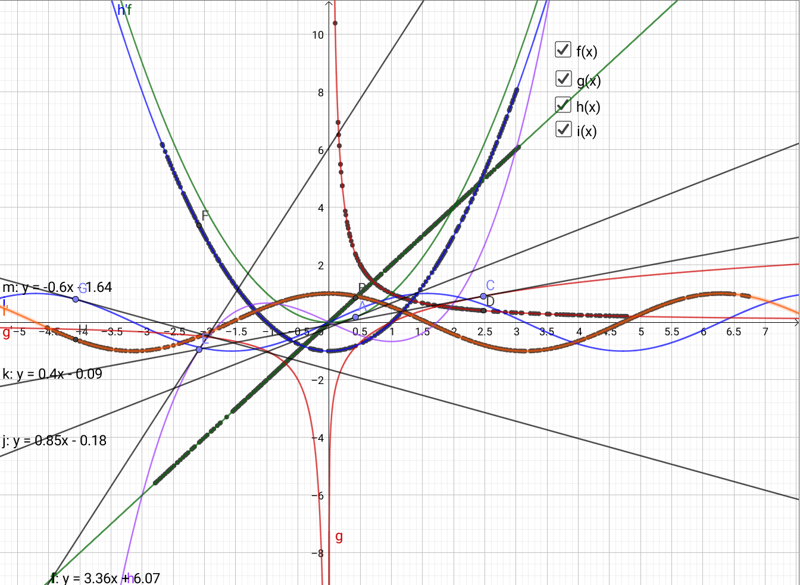

#+attr_reveal: :frag (appear)
- Vi må nok tage det én funktion af gangen.

#+reveal_html: 

** $f(x)=x^2$
#+reveal_html: 

#+attr_html: :height 400px
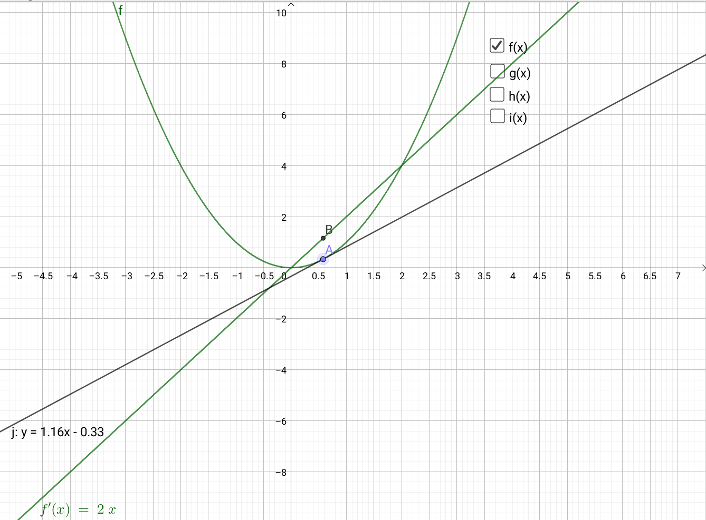

- Den /afledte/ funktion er
  $$f'(x) = 2x$$

** $g(x)=ln(x)$
#+reveal_html: 

#+attr_html: :height 400px
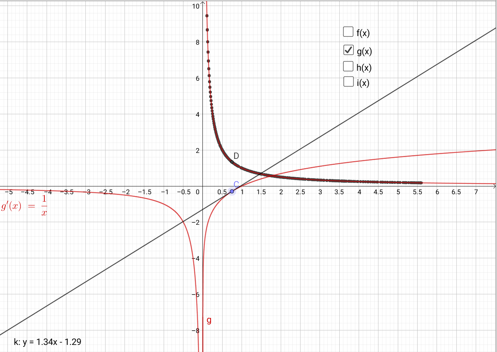

- Den /afledte/ funktion er
  $$g'(x) = \frac{1}{x}$$
  
** $h(x)=\frac{1}{3}x^3-x$
#+reveal_html: 

#+attr_html: :height 400px
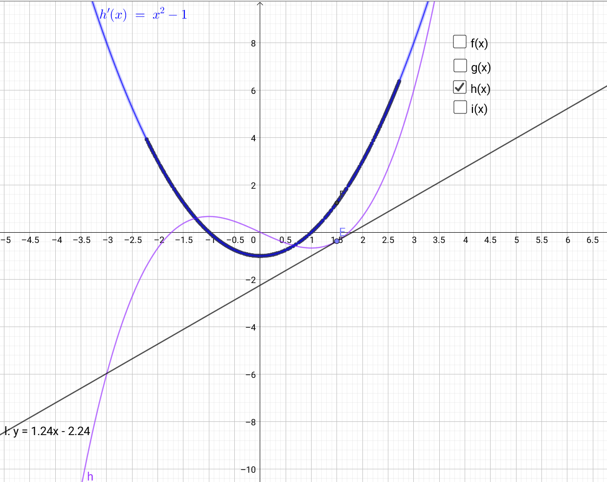

- Den /afledte/ funktion er
  $$h'(x) = x^2-1$$

** $i(x)=sin(x)$
#+reveal_html: 

#+attr_html: :height 400px
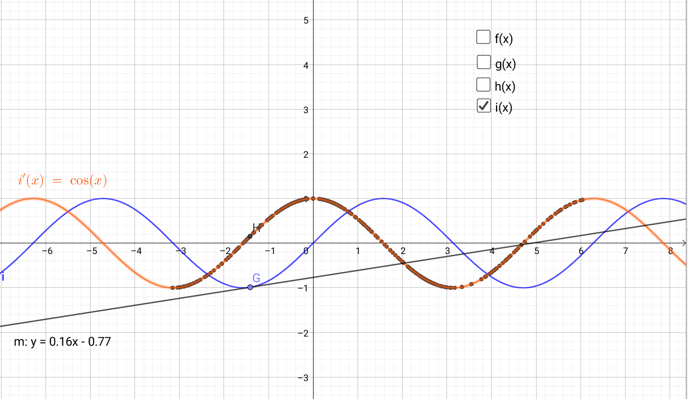

- Den /afledte/ funktion er
  $$i'(x) = cos(x)$$
  
  
** Hvordan bestemmer man så den afledte funktion?
#+reveal_html: 

Ja, man skal anvende *sekanter* og begrebet *grænseværdi*.

#+attr_reveal: :frag (appear)
Grafisk ser de således ud
#+attr_reveal: :frag (appear)
#+attr_html: :height 300px
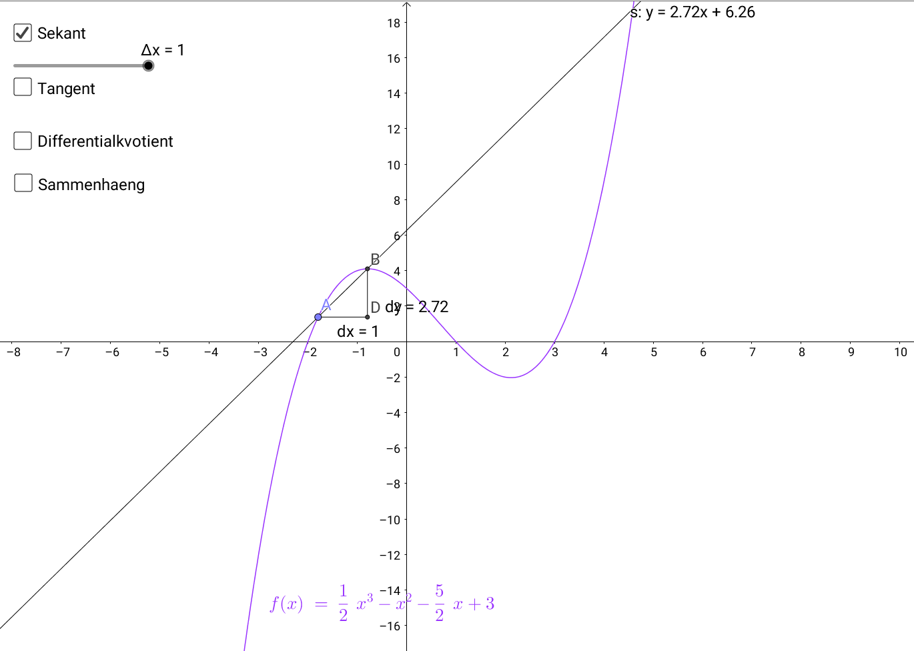

** Tretrinsreglen
#+reveal_html: 

- Trin 1 :: Opskriv /differenskvotienten/ aka /sekantens/ hældning. (Er også gennemsnitshældningen mellem de to punkter.)
  $$a_\text{sekant} = \frac{\Delta y}{\Delta x} = \frac{f(x+\Delta x)-f(x)}{\Delta x}$$
- Trin 2 :: Omskriv det fremkomne udtryk, så næste trin bliver nemmere at gennemføre.
- Trin 3 :: Bestem /differentialkvotienten/ ved at bestemme /grænseværdien/ for $\Delta x \to 0$ for differenskvotienten.
  $$f'(x) = \frac{dy}{dx} = \lim_{\Delta x \to 0} \left( \frac{\Delta y}{\Delta x} \right) = \lim_{\Delta x \to 0} \left( \frac{f(x+\Delta x) - f(x)}{\Delta x} \right)$$

  
** Eksempel
Vi prøver lige på tavlen med
$$f(x) = x^2$$

** Opgaver
#+reveal_html: 

Bestem differentialkvotienterne (de afledte funktioner) for de følgende funktioner vha tretrinsreglen

\begin{align*}
f(x) &= 8x\\
g(x) &= 3x^2 \\
h(x) &= \frac{1}{x} \\
i(x) &= \sqrt{x}
\end{align*}

- Det er lidt tricky for $h(x)$.
- Det noget mere tricky for $i(x)$. Der skal ganges med det smarte et-tal $\frac{\sqrt{x+\Delta x}+\sqrt{x}}{\sqrt{x+\Delta x}+\sqrt{x}}$ på et tidspunkt.

** Mange differentiationsregler
#+reveal_html: 

Man kan bevise alskens regler for differentiation, men det vender vi tilbage til senere. Nu får I bare reglerne foræret.

#+attr_html: :height 500px
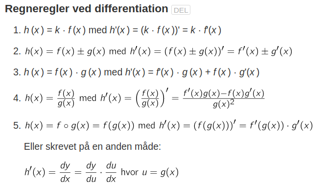

** Kan det så bruges til noget det der differentiation?
#+attr_reveal: :frag (appear)
- Ja, da!
- Til bestemmelse af /tangentligninger/
- Til bestemmelse af /ekstremumspunkter/
- Til bestemmelse af /vendetangentpunkter/ (hvis de findes for funktionen)
- Til fastlæggelse af *monotoniforhold*
- Til optimering (Vi vender tilbage til dette senere i denne præsentation)

** Tangentligninger
#+reveal_html: 

#+attr_html: :width 600px
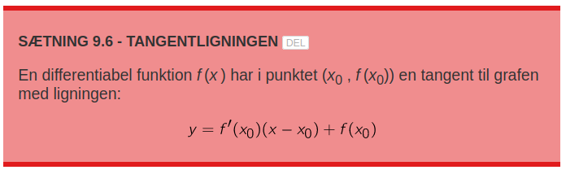

#+attr_reveal: :frag (appear)
- Først tager vi lige beviset på tavlen.
- Og så et eksempel efterfølgende.
#+reveal_html: 

#+reveal_html: 

#+attr_html: :height 500px
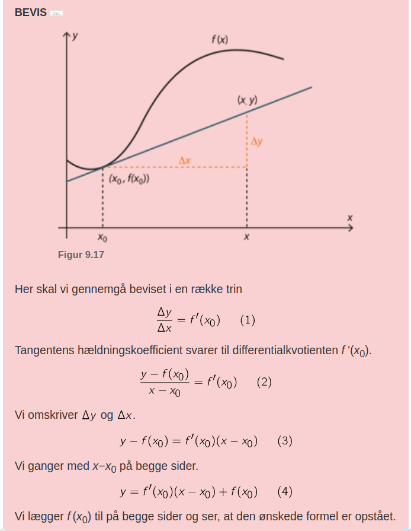
#+reveal_html: 

** Eksempel
#+reveal_html: 

Vi skal finde ligningen for tangenten, som tangerer funktionen $$f(x)=x^2$$ i punktet $(2, f(2))$.

#+attr_reveal: :frag (appear)
- Svaret er $t: y=4x -4$
- Men det tager vi også lige på tavlen.
  
** Opgaver
#+reveal_html: 

Find tangentligningerne for følgende funktioner og punkter:
\begin{align*}
g(x) &= 3 x^2 \quad (3,g(3)) \\
h(x) &= \frac{1}{x} \quad (-2,h(-2)) \\
i(x) &= \sqrt{x} \quad (9,i(9))
\end{align*}

#+attr_reveal: :frag (appear)
- I kan selv overveje, hvorfor vi ikke gider at gøre det for $f(x)=8x$.

  
** Lokale ekstrema og monotoniforhold
#+reveal_html: 

#+reveal_html: 

#+attr_html: :width 600px
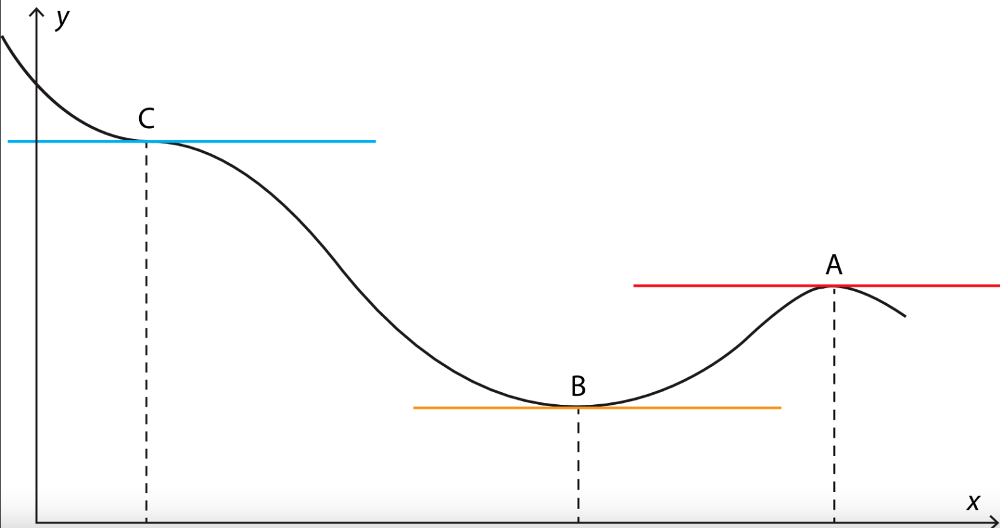
#+reveal_html: 

#+reveal_html: 

#+attr_html: :width 600px
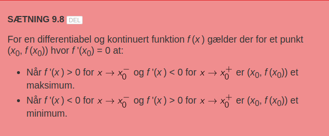

#+reveal_html: 

#+attr_reveal: :frag (appear)
- A er et lokalt maksimum (hældningen går fra positiv til nul til negativ)
- B er et lokalt minimum (hældningen går fra negativ til nul til positiv)
- C er et vandret vendetangentpunkt (hældningen går fra negativ til nul til negativ igen)
- Hvis man har fundet lokale ekstremumspunkter for en funktion, så kan man også fastlægge funktionens /monotoniforhold/.

  
** Eksempel
#+reveal_html: 

Vi tager funktionen
$$f(x)= 3x^2 + 8x$$

- $f(x)$ har lokalt (og globalt) minimumspunkt i (-1.33 , -5.33)
- Monotoniforhold:
  - $f(x)$ er aftagende for x< -1.33
  - $f(x)$ er voksende  for x> -1.33

#+attr_reveal: :frag (appear)
- Det kan alt sammen vises /i blinde/ (uden at tegne grafen) vha. differentialregning, men det må vi hellere lige tage på tavlen.

 
** Opgaver
#+reveal_html: 

Nu skal I selv lige prøve.

Find eventuelle ekstremumspunkter og fastlæg monotoniforholdet for

$$f(x) = - \sqrt{x} + x$$

** Komplet funktionsanalyse
#+reveal_html: 

En komplet funktionsanalyse består af

1. Definitionsmængde
   - Begrænsninger for x-værdier.
   - $Dm(f) = \left\{ x \in \mathbb{R} | \dots \right\}$
2. Bestemmelse af nulpunkter (rødder)
   - $f(x)=0$
   - isolér x i ligningen.
3. Bestemmelse af eventuelle ekstrema
   - $f'(x)=0$
   - isolér x i ligningen.
   - Indsæt x-værdierne i f(x) for at finde de tilhørende y-værdier.
4. Beskrivelse af monotoniforhold
   - Indsæt passende x-værdier før og efter ekstremumspunkterne i forrige punkt i $f'(x)$
   - $f(x)$ er voksende i intervallet/intervallerne $\dots < x < \dots$ 
   - $f(x)$ er aftagende i intervallet/intervallerne $\dots < x < \dots$ 
5. Bestemmelse af Værdimængde
   - Alle y-værdier for $f(x)$.
   - $Vm(f) = \left\{ f(x) \in \mathbb{R} | \dots \right\}$
6. (Bestemmelse af vendetangentpunkter)
   - Sæt $f''(x)=0$
   - Isolér x i ligningen.
   - Indsæt x-værdierne i $f(x)$ for at finde y-værdierne.
7. (Bestemmelse af asymptoter)

   
** Eksempel
#+reveal_html: 

Lad os udføre en funktionsanalyse for

$$f(x) = 6 x - \frac{1}{2} x^3$$

#+attr_reveal: :frag (appear)
1. $Dm(f) = \left\{ x \in \mathbb{R} \right\}$ (Der er ingen begrænsninger for x.)
2. Rødder:
   \begin{align*}
   f(x) &= 0 \\
   6x - \frac{1}{2}x^3 &=0 \\
   x_1 &= 0 \\
   6 - \frac{1}{2}x^2 &= 0 \\
   x_2 &= \sqrt{12} = 3.46 \\
   x_3 &= - \sqrt{12} = - 3.46 \\
   \end{align*}

#+reveal: split
#+reveal_html: 

$$f(x) = 6 x - \frac{1}{2} x^3$$
#+attr_reveal: :frag (appear)
3. [@3] Ekstrema
   \begin{align*}
   f'(x) &= 0 \\
   6 - \frac{3}{2}x^2 &= 0 \\
   x_4 &= -2 \\
   x_5 &= 2  \\
   y_4 = f(x_4) &= 6 (-2) - \frac{1}{2}(-2)^3 =-8 \\
   y_5 = f(x_5) &= 6 \cdot 2 - \frac{1}{2}\cdot 2^3 = 8
   \end{align*}
#+attr_reveal: :frag (appear)
$(-2,-8)$ og $(2,8)$ er altså kandidater til at være ekstremumspunkter.

#+reveal: split
#+reveal_html: 

$$f(x) = 6 x - \frac{1}{2} x^3$$
#+attr_reveal: :frag (appear)
4. [@4] Monotoniforhold
   | $x$     |         -3 |            -2 |          0 |             2 |          3 |
   |---------+------------+---------------+------------+---------------+------------|
   | $f'(x)$ |       -7.5 |             0 |         6. |             0 |       -7.5 |
   | $f(x)$  | $\searrow$ | $\rightarrow$ | $\nearrow$ | $\rightarrow$ | $\searrow$ |
   
   - $f(x)$ er aftagende i intervallerne $x=]-\infty \,;\, -2 [$ og $x = ]2 \,;\, \infty[$
   - $f(x)$ er voksende i intervallet $x=]-2 \,;\, 2 [$
   - $(-2,-8)$ er et lokalt minimum. (Skal stå under forrige punkt)
   - $(2,8)$ er et lokalt maksimum. (Skal stå under forrige punkt)
5. Værdimængde
   $$Vm(f) = \left\{ f(x) \in \mathbb{R} \right\}$$
   - Det kan ses ud fra forskriften og monotoniforholdet.

#+reveal: split
#+reveal_html: 

$$f(x) = 6 x - \frac{1}{2} x^3$$
#+attr_reveal: :frag (appear)
6. [@6] Vendetangentpunkter
   \begin{align*}
   f'(x) &= 6 - \frac{3}{2}x^2 \\
   f''(x) &= - \frac{6}{2}x = - 3 x \\
   -3x &= 0 \to x=0 \\
   f(0) &= 6\cdot 0 - \frac{1}{2}\cdot 0^3 = 0
   \end{align*}
   - Altså er der en kandidat til et Vendetangentpunkt i (0,0)
   
   \begin{align*}
   f''(-1) &= -3 \cdot (-1) = 3 \\
   f''(1) &= -3 \cdot 1 = -3 
   \end{align*}
   - (0,0) er et vendetangentpunkt, da $f''(x)$ skifter fortegn omkring $x=0$.

#+reveal: split
#+reveal_html: 

$$f(x) = 6 x - \frac{1}{2} x^3$$
Konklusion
- Rødder: (-3.46,0) , (0,0),  (3.46,0)  ( (0,0) er også skæringen med y-aksen) )
- Lokalt minimum: (-2,-8)
- Lokalt maksimum: (2,8)
- Vendetangentpunkt: (0,0)
- Monotoniforhold:
  - $f(x)$ er aftagende i intervallerne $x=]-\infty \,;\, -2 [$ og $x = ]2 \,;\, \infty[$
  - $f(x)$ er voksende i intervallet $x=]-2 \,;\, 2 [$
#+reveal: split
#+reveal_html: 

Grafisk konklusion

Det ser ud til at passe meget godt. :)
#+reveal_html: 

#+attr_html: :height 500px
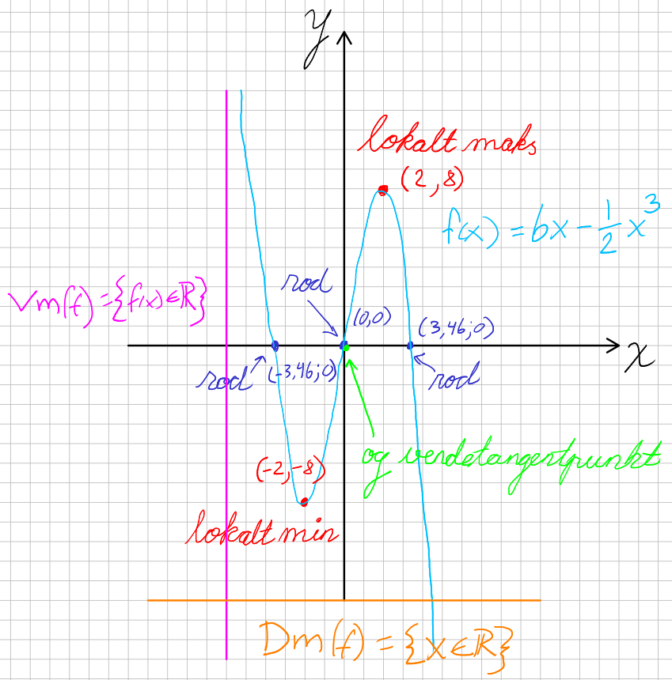
#+reveal_html: 

#+reveal_html: 

#+attr_html: :height 500px
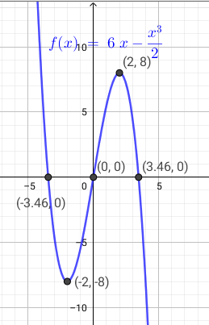
#+reveal_html: 

** Optimering
#+reveal_html: 

- Nu skal det der differentialligning bruges til noget rigtig godt.
- Det er jo altid godt, at kunne beregne den *optimale* størrelse.

Fremgangsmåde:
1. Analysér problemstillingen. Matematisér den.
2. Opstil udtryk med én ubekendt variabel, som kan maksimeres eller minimeres. Mange gange skal flere ligninger sættes sammen til en.
3. Differentiér udtrykket og sæt lig nul.
4. Løs ligningen.
5. Udfør en fortegnsundersøgelse omkring rødderne i ligningen for at afgøre, om der er tale om maksima eller minima.

   
** Eksempel
#+reveal_html: 

#+attr_html: :width 800px
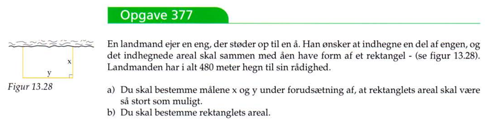

#+attr_reveal: :frag (appear)
1. Matematisering
      
   \begin{align*}
   \text{Længde} &= 2x + y = 480\\
   \text{Areal} &= x\cdot y
   \end{align*}

#+attr_reveal: :frag (appear)   
- Der er to variable. Men $y$ kan isoleres i ligningen for længden og indsættes i ligningen for arealet.

#+reveal: split
#+reveal_html: 

#+attr_reveal: :frag (appear)
- Længde: $$ 2x +y = 480 \to y = 480 - 2x$$
- Areal:
  \begin{align*}
  A &= x\cdot y \\
  A &= x\cdot \left( 480 - 2x \right) \\
  A(x) &= 480x - 2x^2
  \end{align*}
- Nu kan det differentieres:
  \begin{align*}
  A'(x) &= 480 - 4 x \\
  0 &= 480 -4x \\
  x &= \frac{480}{4} \\
  x &= 120
  \end{align*}

#+reveal: split
#+reveal_html: 

Fortegnsundersøgelse for $A'(x)$
\begin{align*}
A'(x) &= 480 - 4 x \\
A'(100) &= 480 - 4 \cdot 100 = 80 \\
A'(150) &= 480 - 4 \cdot 150 = -120 
\end{align*}

Hældningen går altså fra positiv over nul til negativ. *Ergo er der tale om et maksimumspunkt*.

#+attr_reveal: :frag (appear)
- Den *optimale x-værdi er da x=120*.
- Den tilhørende optimale y-værdi kan nu beregnes vha udtrykket for længden:
  \begin{align*}
  y &= 480 - 2 x \\
  y &= 480 - 2 \cdot 120 \\
  y &= 240
  \end{align*}
#+reveal: split
#+reveal_html: 

De optimale mål og arealet er da:
\begin{align*}
x &= 120\\
y &= 240 \\
A(x,y) &= x \cdot y \\
A(120, 240) &= 120 \cdot 240 =28800 
\end{align*}

** Opgaver
#+reveal_html: 

Nu er der fri leg blandt de følgende opgaver.
#+reveal_html: 

#+attr_html: :width 500px
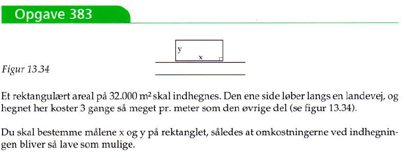

#+attr_html: :width 500px
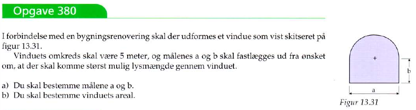
#+reveal_html: 

#+reveal_html: 

#+attr_html: :width 500px
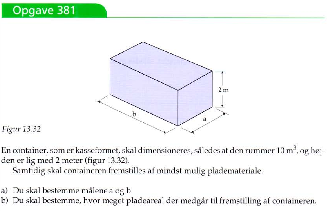
#+reveal_html: 

** Differentiationsregler
#+reveal_html: 

#+attr_html: :width 100%
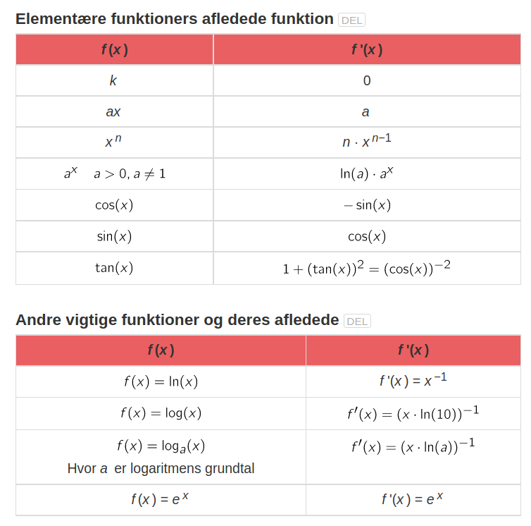
#+reveal_html: 

#+reveal_html: 

#+attr_html: :width 100%

#+reveal_html: 

* Intro til integration
Der skældnes mellem ubestemte og bestemte integraler.
** Ubestemte integraler
#+reveal_html: 

- Et ubestemt integral er det samme som at finde en /stamfunktion/ til en funktion.
- En stamfunktion er en /anti/​-afledt funktion.
- At integrere er altså det /modsatte/ af at differentiere.

Notation:
#+attr_html: :height 300px
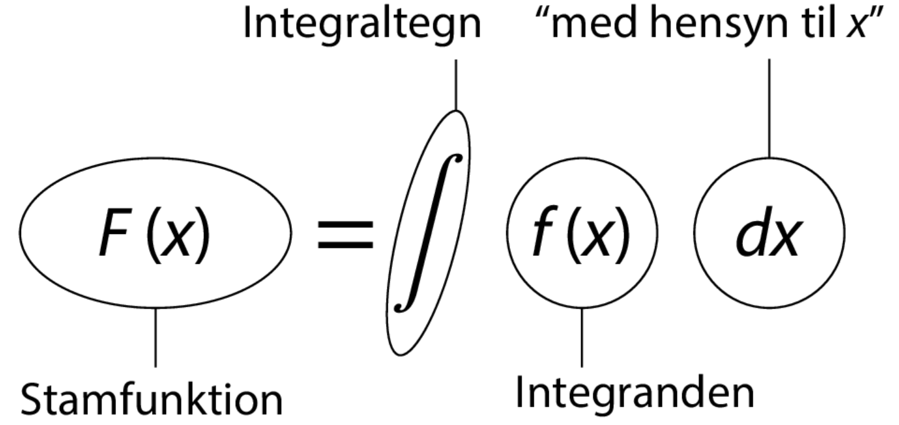

#+reveal: split
#+reveal_html: 

- Bestemt integration og differentiation går ud med hinanden

#+reveal_html: 

Her differentieres en stamfunktion for at finde en /oprindelig/ funktion.
\begin{align*}
F'(x) &= f(x) \\
\frac{d F(x)}{dx} &= f(x) \\
\left( \int f(x) \,dx \right)' &= f(x) \\
\frac{d}{dx} \left( \int f(x)\,dx \right) &= f(x) \\
\end{align*}
#+reveal_html: 

#+reveal_html: 

Her integreres en afledt funktion for at finde en /oprindelig/ funktion, men der kommer lige en ekstra /konstant/ på.
\begin{align*}
\int f'(x) \,dx &= f(x) + k
\end{align*}
#+reveal_html: 

** Integrationsprøven
#+reveal_html: 

Man kan undersøge om en opgivet stamfunktion er korrekt, ved at differentiere stamfunktionen og tjekke at dette udtryk er lig den oprindelige funktion.

*Eksempel*
Der oplyses en funktion $f(x)=2 x$. Eftervis at $F(x)=x^2$ er en stamfunktion til $f(x)$.
#+attr_reveal: :frag (appear)
\begin{align*}
F'(x) &= \left( x^2 \right)'  = 2x
\end{align*}

#+attr_reveal: :frag (appear)
Hvad så med $F(x) = x^2 +4$? Er det også en stamfunktion til $f(x)$?
  
** Opgaver
#+reveal_html: 

Gæt jer til stamfunktionerne til følgende funktioner, ved at tjekke om jeres gæt giver den oprindelige funktion, når I differentiere. (I må gerne differentiere vha geogebra/wordmat, =afledede= i geogebra)

\begin{align*}
f(x) &= 3x \\
g(x) &= 3x^2 \\
h(x) &= 2x^3 \\
i(x) &= 10x^{4}
\end{align*}

#+attr_reveal: :frag (appear)
- Kan I finde en generel formel til at finde stamfunktionen til $x^n$?
- Svaret er: $f(x) = x^n \to F(x) = \frac{x^{n+1}}{n+1} + k$

** Flere Opgaver
#+reveal_html: 

$$\int x^n\,dx = \frac{x^{n+1}}{n+1}\, (+k)$$

Bestem de følgende ubestemte integraler (find stamfunktioner)

1. $\int x^6 \,dx$
2. $\int \frac{1}{x^5} \,dx$
3. $\int \sqrt[4]{x} \,dx$
4. $\int \frac{1}{\sqrt[3]{x}} \,dx$
** Bestemte integraler
#+reveal_html: 

Bestemmelse af areal mellem graf og x-aksen.

#+reveal_html: 

Infinitesimalregningens fundamentalsætning 
$$\text{Areal} = \int_a^b f(x) \,dx = \left[ F(x) \right]_a^b = F(b) - F(a)$$

#+attr_reveal: :frag (appear)
(Den må være meget vigtig med det lange navn)
#+attr_reveal: :frag (appear)
- a og b er hhv /nedre/ og /øvre/ grænse
- $f(x)$ er /integranden/
- $dx$ angiver den variabel, der integreres med hensyn til
- $F(b)$ og $F(a)$ er /stamfunktionen/ til $f(x)$, hvor b og a er indsat i stedet for x.
#+reveal_html: 

#+reveal_html: 

#+attr_html: :width 500px
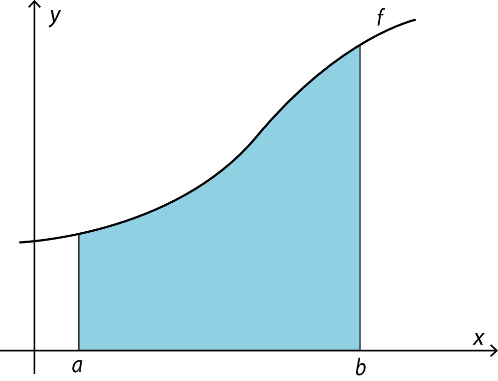
#+reveal_html: 

** Eksempel
#+reveal_html: 

#+reveal_html: 

Lad os bestemme det røde areal, som vist på figuren til højre.
#+attr_reveal: :frag (appear)
- Vi skal bruge $$\int_a^b f(x) \,dx = \left[ F(x) \right]_a^b = F(b) - F(a)$$
- $a=-1$ og $b=2$
- $f(x)=x^2 \to F(x) = \frac{x^3}{3}$
- Sat sammen bliver det:
  \begin{align*}
  \int_{-1}^2 x^2 \,dx &= \left[ \frac{x^3}{3} \right]_{-1}^2 = \frac{2^3}{3} - \frac{(-1)^3}{3} \\
  &= \frac{8}{3} + \frac{1}{3} = \frac{9}{3} = 3 
  \end{align*}
#+reveal_html: 

#+reveal_html: 

#+DOWNLOADED: screenshot @ 2022-02-20 14:21:48
#+attr_html: :width 600px
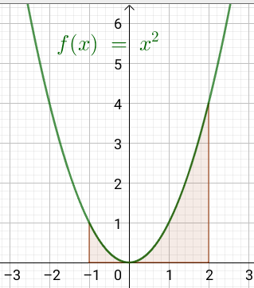

#+reveal_html: 

** Opgaver - Find sammenhænge
#+reveal_html: 

Bestem størrelserne af følgende bestemte integraler:
1. $\int_0^1 x^3\,dx$
2. $\int_1^0 x^3\,dx$
3. $\int_{-1}^0 x^3\,dx$
4. $\int_{-1}^1 x^3\,dx$

#+attr_reveal: :frag (appear)
- Hvilke sammenhænge har I fundet?

** Sammenhænge
#+reveal_html: 

#+reveal_html: 

- Arealer /over/ x-aksen er positive.
  $$\int_0^1 x^3\,dx = \left[ \frac{x^4}{4} \right]_0^1 = \frac{1^4}{4}-\frac{0^4}{4} =\frac{1}{4}$$
- Arealer /under/ x-aksen er negative.
  $$\int_{-1}^0 x^3\,dx = \left[ \frac{x^4}{4} \right]_{-1}^0 =\frac{0^4}{4}-\frac{(-1)^4}{4} = - \frac{1}{4}$$
- Arealer over og under x-aksen udligner hinanden.
  $$\int_{-1}^1 x^3\,dx = \left[ \frac{x^4}{4} \right]_{-1}^1 = \frac{1^4}{4}-\frac{(-1)^4}{4} = 0$$
- Hvis integrationsgrænserne ombyttes, skiftes også fortegnet for arealet.
  $$\int_b^a f(x) \,dx = - \int_a^b f(x) \,dx$$
#+reveal_html: 

#+reveal_html: 

#+DOWNLOADED: screenshot @ 2022-02-20 14:39:24
#+attr_html: :width 300px
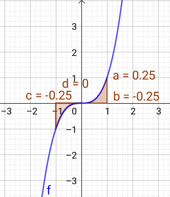
#+reveal_html: 

** Flere opgaver
#+reveal_html: 

Bestem størrelsen af følgende bestemte integraler

1. $\int_1^3 \frac{1}{x^5}\,dx$
2. $\int_0^2 \sqrt{x}\,dx$
3. $\int_0^3 2 x^3-12x\,dx$
4. $\int_2^3 \frac{1}{\sqrt{x}}\,dx$
   
** Arealer over og under x-aksen
#+reveal_html: 

#+reveal_html: 

Hvis man vil finde størrelsen af det markerede areal, skal man dele integralet op i to. Et integral, hvor grafen er over x-aksen og et integral, hvor grafen er under x-aksen, altså:
\begin{align*}
\int_{-2}^{-1} x^2-x-2 \,dx &=  \left[ \frac{x^3}{3}-\frac{x^2}{2}-2x \right]_{-2}^{-1} = \frac{11}{6} = 1.83 \\
\left| \int_{-1}^2 x^2-x-2\,dx \right| &=\left| \left[ \frac{x^3}{3}-\frac{x^2}{2}-2x \right]_{-1}^{2} \right| = \left|- \frac{9}{2}  \right| = 4.5\\
\end{align*}
*I alt 6.33*

#+reveal_html: 

#+reveal_html: 

#+DOWNLOADED: screenshot @ 2022-02-21 08:08:17
#+attr_html: :width 200px
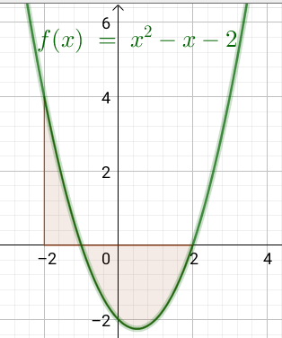

#+attr_reveal: :frag (appear)
Det naive forsøg giver
$$\int_{-2}^2 x^2-x-2\,dx = \left[ \frac{x^3}{3}-\frac{x^2}{2}-2x \right]_{-2}^2 = - \frac{8}{3}$$
#+reveal_html: 

** Areal mellem grafer
#+reveal_html: 

#+reveal_html: 

- Det er ligegyldigt, om funktionerne ligger over eller under x-aksen.
- Det er vigtigt, at en funktion altid ligger over den anden i det interval, der integreres over.
- Alternativt, del integralet op, hvor graferne skærer hinanden.

$f(x) > g(x)$ for $a < x < b$ gælder

$$\text{Areal}=\int_a^b f(x) - g(x) \,dx$$

#+reveal_html: 

#+reveal_html: 

#+attr_html: :height 250px
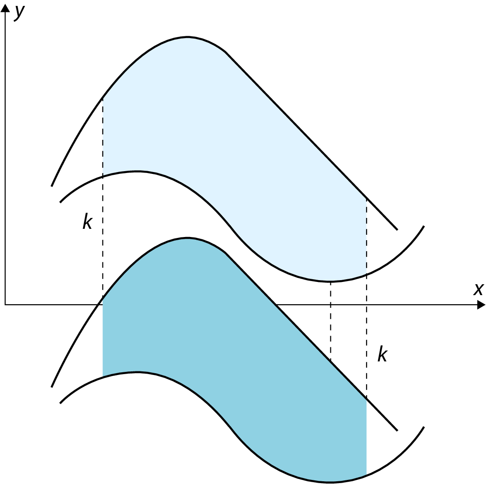
#+attr_html: :height 200px
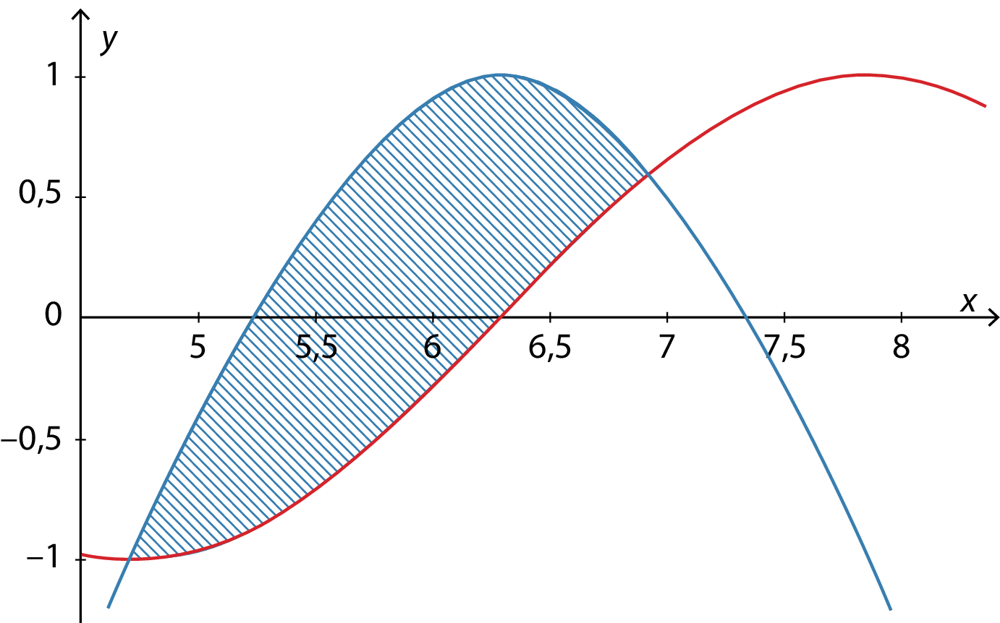
#+reveal_html: 

** Opgaver om arealer
#+reveal_html: 

#+reveal_html: 

*Opgave 1*

Bestem det samlede areal, der begrænses af x-aksen og grafen for funktionen

$$f(x) = (x+1)\cdot(x-3) \cdot (x-5) = x^3 - 7 x^2 +7x +15$$

*Opgave 2*

Bestem arealet af den lukkede figur, der dannes af funktionerne

\begin{align*}
f(x) &= -x^2+2x+1 \\
g(x) &= - \frac{1}{2} x +1
\end{align*}
#+reveal_html: 

#+reveal_html: 

*Opgave 3*

#+attr_html: :height 200px
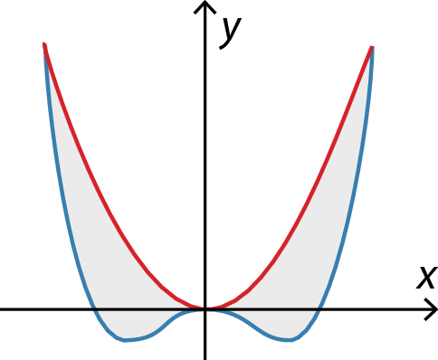

Figuren viser en del af graferne for funktionerne $f$ og $g$ samt et tonet område A.

Funktionerne har forskrifterne

\begin{align*}
f(x) &= 2 x^2 \\
g(x) &= x^4 - 2x^2
\end{align*}

- Bestem arealet af det viste område A.
#+reveal_html: 

** Flere træningsopgaver
#+reveal_html: 

Udregn de følgende bestemte integraler. Skriv det hele i hånden, så I får øvet jer.

Slå stamfunktionerne op på næste slide.

1. $\int_0^2x^4 \,dx$
2. $\int_3^5 x^{-2} \, dx$
3. $\int_4^7 6 \, dx$
4. $\int_{-3}^5 \, dx$
5. $\int_1^2 3^x \, dx$
6. $\int_1^4 \sqrt{x} \, dx$
** Oversigt integrationsregler
#+reveal_html: 

#+attr_html: :width auto :height 430px 
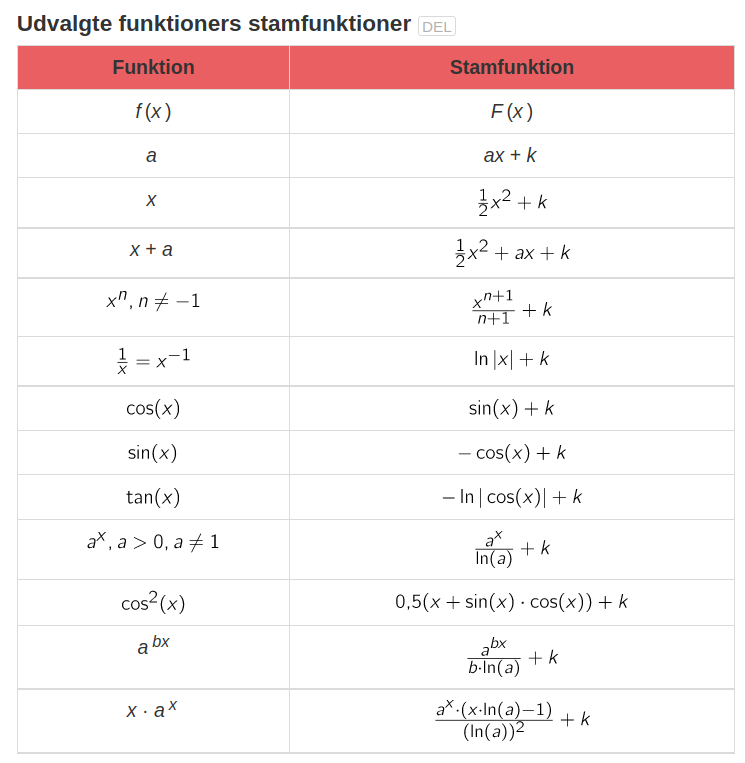
#+reveal_html: 

#+reveal_html: 

#+attr_html: :width 70%
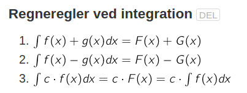

#+attr_html: :width 70%
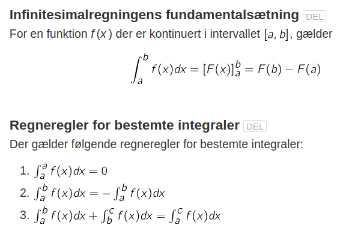
#+reveal_html: 

* Den lineære funktion
#+begin_quote
Ikke så meget nyt under solen
#+end_quote

** Bestemmelse af forskrift
#+reveal_html: 

#+reveal_html: 

*Hvis man kun har /2/ kendte punkter*

\begin{align*}
P_1&=(x_1,y_1) \text{ og } P_2 = (x_2, y_2) \\
f(x)&=a \cdot x + b \\
a&= \frac{\Delta y}{\Delta x} =\frac{y_2-y_1}{x_2 - x_1} \\
b&= y_1 - a \cdot x_1 = y_2-a \cdot x_2
\end{align*}

#+attr_html: :width 300px
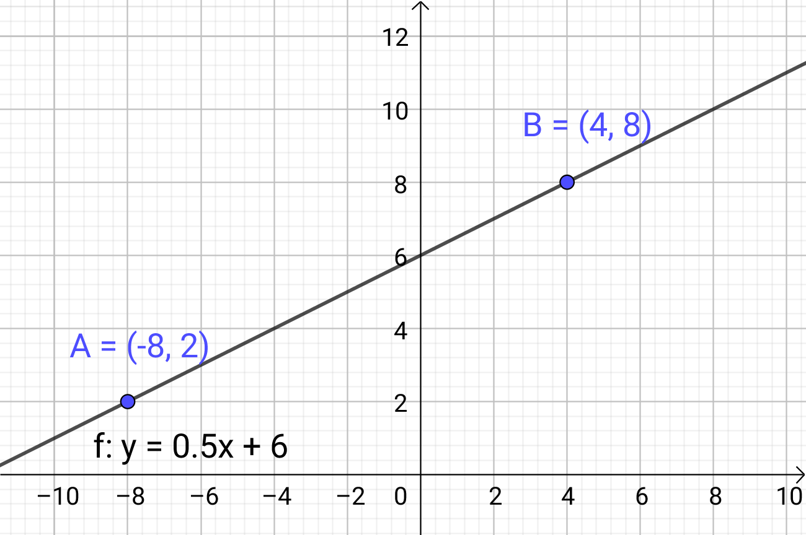
#+reveal_html: 

#+reveal_html: 

*Hvis man kender /mange/ punkter*

Lineær regression i f.eks. =geogebra=

- =liste1 = {A,B,C,D,E}=
- =fitlinje(liste1)=
#+attr_html: :width 300px
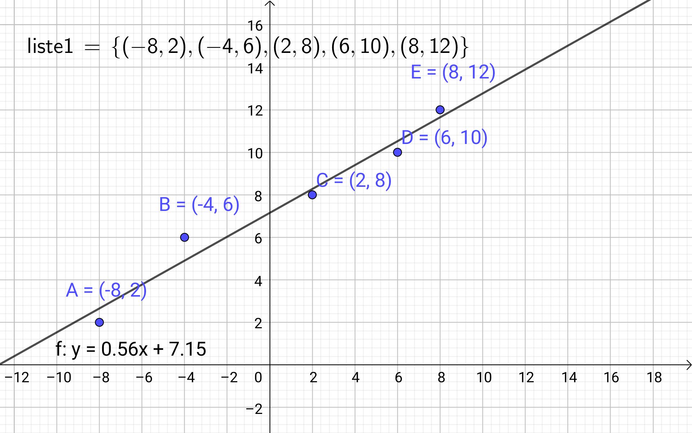
#+reveal_html: 

** Afledt funktion og stamfunktion
#+reveal_html: 

#+reveal_html: 

*Afledt funktion*

\begin{align*}
f(x)&= a\cdot x + b \\
f'(x) &= \frac{d}{dx}\left( a\cdot x +b \right) = a
\end{align*}
- Hældningen er den samme for /alle/ x-værdier.
  
*Stamfunktion*

\begin{align*}
f(x) &= a \cdot x +b \\
F(x) &= \int a \cdot x + b \,dx = \frac{a}{2} \cdot x^2 + b \cdot x + k
\end{align*}
- Stamfunktionen er altså en /parabel/ (mere om den senere).
#+reveal_html: 

#+attr_html: :width 400px
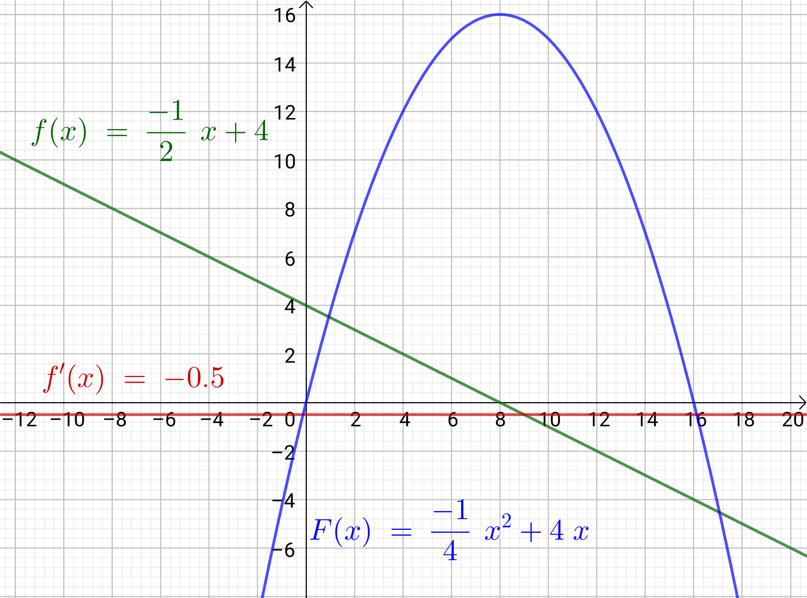
#+reveal_html: 

#+reveal_html: 

** Hvad kan det så bruges til?
#+attr_reveal: :frag (appear)
Ja, i fysik blandt andet!

#+attr_reveal: :frag (appear)
Lad os se på lidt /kinematik/.

** (t,s)-, (t,v)- og (t,a)-diagrammer
#+reveal_html: 

Roll racing!
#+begin_export html
<iframe width="600" height="400" src="https://www.youtube.com/embed/rNo5xfjxj6c" title="YouTube video player" frameborder="0" allow="accelerometer; autoplay; clipboard-write; encrypted-media; gyroscope; picture-in-picture" allowfullscreen></iframe>
#+end_export

*** (t,v)-diagram
#+reveal_html: 

Lad os se lidt på en graf over hastigheden som funktion af tiden.
- Typisk starter racet ved 40 mph, altså 64.37 km/h eller 17.88 m/s.
- Accelerationsrekorden for en dragracer er vist "6g", men lad os antage at bilerne her trækker 2 eller 3 g. Altså en acceleration på $a=2 \cdot 9.82 m/s^2= 19.64 m/s^2$.
- Lad os bare antage at accelerationen er konstant (Det kan den ikke være i virkeligheden.)

#+attr_reveal: :frag (appear)
#+attr_html: :width 500px
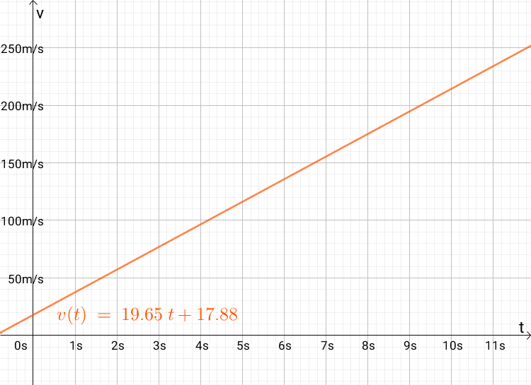

*** (t,a)-diagram
#+reveal_html: 

#+attr_reveal: :frag (appear)
- Hvis man differentierer hastigheden får man accelerationen.
- $a(t) = \frac{d}{dt}\left( v \right) = \frac{d}{dt} \left( 19.64 \cdot t + 17.88 \right)$
- $a(t) = 19.64 \,m/s^2$
- Accelerationen er bare konstant.

#+attr_reveal: :frag (appear)
#+attr_html: :width 500px
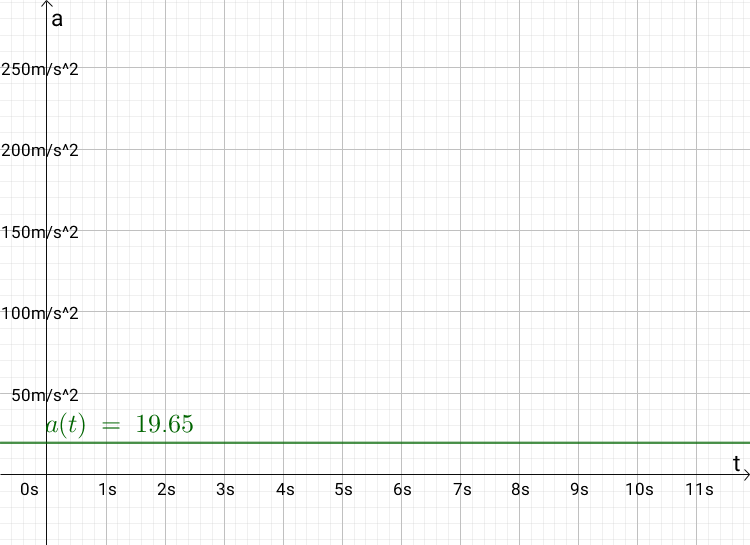

*** (t,s)-diagram
#+reveal_html: 

#+attr_reveal: :frag (appear)
- Hvis man integrerer hastigheden får man strækningen.
- $s(t)= \int v(t) \,dt = \int 19.64 \cdot t + 17.88 \,dt$
- $s(t)= 19.64 \cdot \frac{t^2}{2} + 17.88\cdot t + k$
- $k$ er en integrationskonstant. Det kan være startstrækningen til tiden 0. Vi sætter den bare til nul.

#+attr_reveal: :frag (appear)
#+attr_html: :width 500px
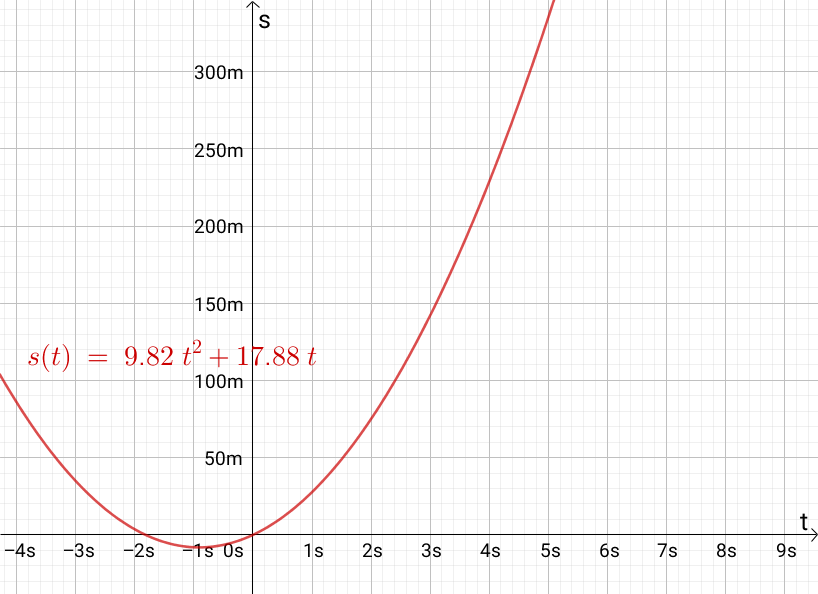

*** Alles zusammen
#+attr_html: :width 500px
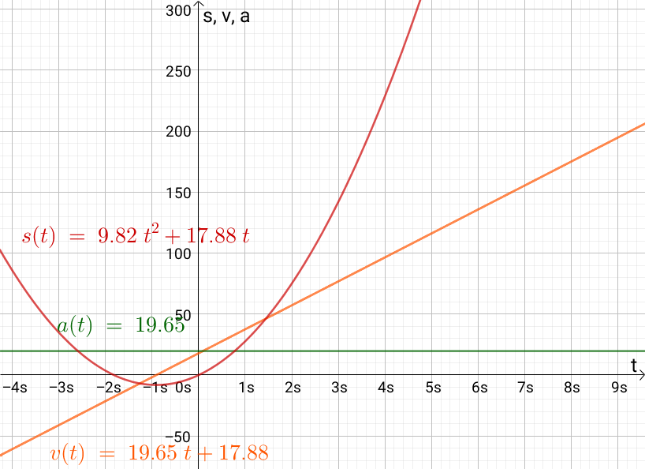

** +Kongens+ tuschens fald
Vi tager lige analysen og beregningerne foran og på tavlen.

Vi skal bruge
- Stopur (mobiltelefon)
- Tommestok
** Opgaver
#+reveal_html: 

#+reveal_html: 

*Simpel*
#+attr_html: :width 400px
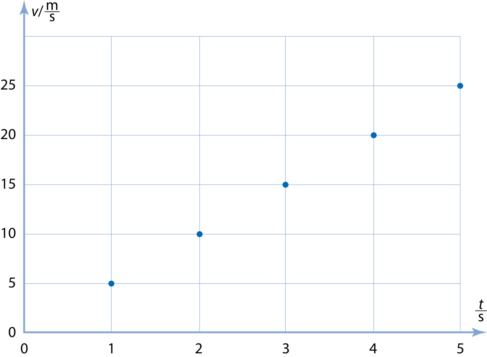

Grafen viser 5 målinger af hastigheden som funktion af tiden.
1. Opstil en forskrift for hastigheden som funktion af tiden.
2. Bestem accelerationen vha. differentialregning.
3. Bestem den tilbagelagte strækning i de første 5 sekunder vha integralregning.
#+reveal_html: 

#+reveal_html: 

*Middel*
#+attr_html: :width 400px
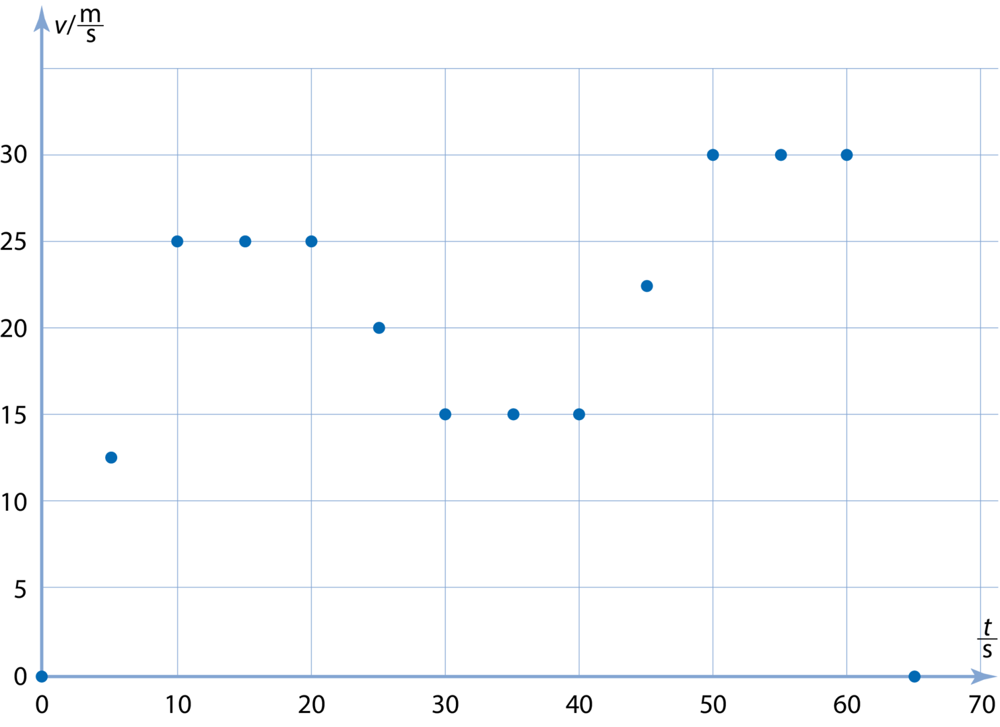

Grafen viser 14 målinger af hastigheden til forskellige tidspunkter.

1. Bestem i hvilke intervaller, der er tale om acceleration, og hvor, der er tale om konstant hastighed.
2. Bestem accelerationerne i de forskellige intervaller.
3. Bestem den tilbagelagte strækning i det fulde intervarl 0 til 65 s vha integralregning. (Del op i mindre funktioner for hver bevægelsestype.)
#+reveal_html: 

#+reveal: split
#+reveal_html: 

*En ekstra dejlig udfordring*

Forestil jer en bil, som sætter i gang. I det øjeblik den starter er accelerationen på 8.7 m/s^{2}. Accelerationen falder lineær, og efter 5.8 sekunder er accelerationen på nul.

1. Bestem en forskrift for accelerationen som funktion af tiden.
2. Bestem en forskrift for hastigheden som funktion af tiden. Beregn, hvor hurtigt bilen kører efter de 5.8 sekunder.
3. Bestem en forskrift den tilbagelagte strækning som funktion af tiden. Beregn den tilbagelagte strækning efter de 5.8 sekunder.
* Parablen
#+reveal_html: 

#+attr_html: :width auto :height 300px

#+reveal_html: 

#+reveal_html: 

#+attr_html: :width auto :height 300px

#+reveal_html: 

** Forskriften
#+reveal_html: 

Den generelle forskrift for en parabel er

$$f(x) = a \cdot x^2+ b \cdot x + c$$

Grafen for parablen afhænger af parablens /koefficienter/ $a$, $b$ og $c$.

*Hvilken betydning har $a$, $b$ og $c$ for grafens udseende?*

#+begin_export html
<iframe
width="400"
height="400"
src="./ggb/Parablens_koefficienter.html"
title="Parablens koefficienter"
frameborder="0">
</iframe>
#+end_export

** Skæring med akserne
#+reveal_html: 

$$f(x)=a\cdot x^2+ b \cdot x + c$$
#+reveal_html: 

*y-aksen*

#+attr_reveal: :frag (appear)
- Den er nem.
- y-aksen ligger der, hvor $x=0$.
- $y=f(x) = a \cdot 0^2 + b \cdot 0 +c =c$
- Skæring med y-aksen er koefficienten $c$
- (Altså koefficienten uden et x ganget på.)
#+reveal_html: 

#+reveal_html: 

*x-aksen*

#+attr_reveal: :frag (appear)
- x-aksen ligger der, hvor $y=f(x)=0$
- Altså $f(x)=a\cdot x^2 + b \cdot x +x =0$
- Hov, vi har altså en 2.gradsligning, som skal løses.
- Det tager vi lige en gang til.
#+reveal_html: 

** 2.gradsligninger
#+reveal_html: 

For
$$a\cdot x^2+b \cdot x + c =0$$
er den generelle løsning

$$\boxed{x = \frac{-b \pm \sqrt{d}}{2 \cdot a}}$$

hvor /diskriminanten/ er

$$\boxed{d = b^2- 4 \cdot a \cdot c}$$.

- Hvis $d>0$ (altså positiv) er der *to* løsninger.
- Hvis $d=0$ er der *én* løsning.
- Hvis $d<0$ (altså negativ) er der *ingen reelle* løsninger.

  
*** Eksempler
#+reveal_html: 

Det hele står her, men vi tager det lige på tavlen.
#+reveal_html: 

$$x^2-2x-3 =0$$
#+attr_reveal: :frag (appear)
\begin{align*}
a &= 1 \,,\, b=-2 \,,\, c=-3 \\
d &= (-2)^2- 4 \cdot 1 \cdot (-3) = 16 \\
x &= \frac{-(-2) \pm \sqrt{16}}{2 \cdot 1} \to \boxed{x_1 = 3 \,,\, x_2 = -1}
\end{align*}

$$3 x^2 - 12 x + 12=0$$
#+attr_reveal: :frag (appear)
\begin{align*}
a &= 3 \,,\, b=-12 \,,\, c=12 \\
d &= (-12)^2- 4 \cdot 3 \cdot 12 = 0 \\
x &= \frac{-(-12) \pm \sqrt{0}}{2 \cdot 3} \to \boxed{x = 2}
\end{align*}

#+reveal_html: 

#+reveal_html: 

$$3+2x^2=0$$
#+attr_reveal: :frag (appear)
\begin{align*}
a &= 2 \,,\, b=0 \,,\, c=3 \\
d &= 0^2- 4 \cdot 2 \cdot 3 = -24 \\
x &= \frac{-0 \pm \sqrt{-24}}{2 \cdot 2} \\
&\boxed{\text{ingen reel løsning}}
\end{align*}
#+reveal_html: 

*** Opgave
#+reveal_html: 

Beregn skæringerne (hvis nogen) med x-aksen for følgende parabler.

\begin{align*}
f(x)&= 3x^2+5x+2 \\
g(x) &= 1 + 9x^2 -6 x \\
h(x) &= 8x -8x^2-3
\end{align*}

*** Bevis for formlen
#+reveal_html: 

Vi skal "bare" isolere x i ligningen
$$a\cdot x^2 + b \cdot x + c = 0$$
Alle mellemregninger står her, men det er bedst at se live, så vi tager den lige på tavlen.
\begin{align*}
a\cdot x^2 + b \cdot x + c &= 0 \\
a\cdot x^2 + b \cdot x &= -c \\
x^2 + \frac{b}{a} \cdot x &= -\frac{c}{a} \\
\left( x + \frac{b}{2 a} \right)^2 - \left( \frac{b}{2 a} \right)^2 &= - \frac{c}{a} \quad \boxed{\text{obs her}}\\
\left( x + \frac{b}{2 a} \right)^2  &= - \frac{c}{a}+\left( \frac{b}{2 a} \right)^2  \\
\left( x + \frac{b}{2 a} \right)^2  &= - \frac{c}{a}+\frac{b^2}{2^2 a^2}   \\
\end{align*}
#+reveal: split
#+reveal_html: 

\begin{align*}
\left( x + \frac{b}{2 a} \right)^2  &= - \frac{c}{a}+\frac{b^2}{4 a^2}   \\
\left( x + \frac{b}{2 a} \right)^2  &= - \frac{4\cdot a \cdot c}{a\cdot 4 a}+\frac{b^2}{4 a^2}   \\
\left( x + \frac{b}{2 a} \right)^2  &= \frac{b^2 -4\cdot a \cdot c}{4 a^2}   \\
x + \frac{b}{2 a}   &= \pm \sqrt{\frac{b^2 -4\cdot a \cdot c}{4 a^2}}   \\
x + \frac{b}{2 a}   &= \pm \frac{\sqrt{b^2 -4\cdot a \cdot c}}{\sqrt{4 a^2}}   \\
x + \frac{b}{2 a}   &= \pm \frac{\sqrt{b^2 -4\cdot a \cdot c}}{2 a}   \\
x    &= -\frac{b}{2 a} \pm \frac{\sqrt{b^2 -4\cdot a \cdot c}}{2 a}   \\
\end{align*}
$$\boxed{x= \frac{-b \pm \sqrt{b^2 -4\cdot a \cdot c}}{2 a}}$$

** Toppunkt
#+reveal_html: 

#+begin_quote
En parabel med forskriften
$$f(x)=a x^2 + b x +c$$
har toppunkt (eller minimumspunkt) i
$$T = \left( - \frac{b}{2a} \,,\, - \frac{d}{4a} \right)$$
hvor $d= b^2-4 a c$
#+end_quote

** Opgave
#+reveal_html: 

- Vælg *2 forskellige* parabler med forskellige koefficienter ved at trække i skyderne i geogebraappletten.
- Beregn toppunkterne til de to parabler vha formlen fra forrige slide.
- Tjek at jeres beregninger stemmer med toppunktet i geogebra.

#+begin_export html
<iframe
width="800"
height="600"
src="./ggb/Parablens_toppunkt_ggb.html"
title=""
frameborder="0">
</iframe>
#+end_export

** Bevis for toppunktsformlen
#+reveal_html: 

$$f(x)=a x^2 + b x +c$$
- I toppunktet er tangenten vandret og  /hældningen/ er derfor nul.
- Altså er $f'(x) =0$

\begin{align*}
f'(x) &= 2 a x + b \\
2 a x + b &= 0 \iff \\
x &= - \frac{b}{2a}
\end{align*}

- y-koordinatet findes ved at indsætte de fundne x-koordinat i $f(x)$

#+reveal: split
#+reveal_html: 

\begin{align*}
f(x)&=a x^2 + b x +c \\
y = f\left(- \frac{b}{2a}\right)&=a \left(- \frac{b}{2a}\right)^2 + b \left(- \frac{b}{2a}\right) +c \\
y &= a \cdot \frac{b^2}{4a^2}  - \frac{b^2}{2a}+c \\
y &= \frac{b^2}{4a}  - \frac{b^2}{2a}+c \\
y &= \frac{b^2}{4a}  - \frac{2\cdot b^2}{2\cdot 2a}+\frac{4a}{4a}c \\
y &= \frac{b^2-2 b^2+4 a c}{4a} \\
y &= \frac{-b^2+4 a c}{4a} \\
y &= \frac{-d}{4a} \,\text{, hvor } d= b^2-4 a c
\end{align*}

- Hermed udledt.

** Bestemmelse af forskrift
#+reveal_html: 

Den generelle forskrift for en parabel er som bekendt
$$f(x) = a \cdot x^2 + b \cdot x + c$$
#+attr_reveal: :frag (appear)
- Hvor mange punkter, som grafen skal gå igennem, skal man kende, for at bestemme koefficienterne?
- Hvordan vil I bestemme koefficienterne til en parabel, som går gennem punkterne $(2,-4)$, $(-2,0)$ og $(6,8)$? *Alle hjælpemidler er tilladte!*
  
*** Matematikken bag
#+reveal_html: 

#+reveal_html: 

#+attr_reveal: :frag (appear)
- 3 koefficienter behøver 3 kendte punkter, som skal give 3 ligninger med 3 ubekendte.
- For punkterne $P_1=(x_1,y_1)$, $P_2 = (x_2, y_2)$ og $P_3 = (x_3,y_3)$, bliver de tre ligninger
- 
  \begin{align*}
  y_1 &= a \cdot x_1^2 + b \cdot x_1 + c \\
  y_2 &= a \cdot x_2^2 + b \cdot x_2 + c \\
  y_3 &= a \cdot x_3^2 + b \cdot x_3 + c
  \end{align*}

- Og så skal de bare løses...
#+reveal_html: 

#+reveal_html: 

#+attr_reveal: :frag (appear)
- Det er KLART nemmest med et CAS-værktøj.
  #+DOWNLOADED: screenshot @ 2022-03-20 18:11:27
  #+attr_html: :width 600px
  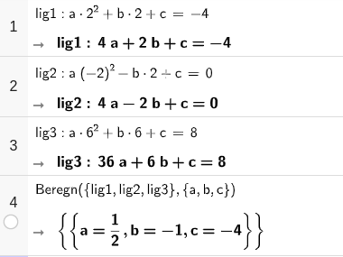
- *Prøv det lige af selv* Læg mærke til *:*, *{}* osv
#+reveal_html: 

*** Opgave
1. Bestem forskriften for en parabel, som går gennem punkterne $(10,235)$, $(1,3)$ og $(0,-5)$
2. Bestem koordinaterne til skæringspunkterne mellem parablens graf og grafen for den lineære funktion, hvis forskrift er $g(x)=\frac{1}{2}x+1$

   Hint: Sæt de to forskrifter lig hinanden, og løs den fremkomne 2.gradsligning. Find her efter y-værdierne.

   
** Differentiation og integration
#+reveal_html: 

Med forskriften $$f(x)=a x^2+b x +c$$ er det nemt at finde den afledte funktion samt stamfunktionen
#+attr_reveal: :frag (appear)
- Jeg er sikker på, at I selv kan finde ud af det...
- Ellers er de her:
  \begin{align*}
  f'(x) &= \frac{d}{dx}\left(a x^2 + b x +c \right) = a \cdot 2 x^{2-1} +b \iff \boxed{f'(x)= 2 a x + b} \\
  F(x) &= \int a x^2 + b x +c \,dx = a \cdot \frac{x^{2+1}}{2+1} + b \cdot \frac{x^{1+1}}{1+1} + c \cdot x + k \iff \boxed{F(x) = \frac{a}{3} x^3 + \frac{b}{2} x^2 + c x + k}
  \end{align*}

  
** Opgave
#+reveal_html: 

Betragt parablen med forskriften $$f(x)= - \frac{1}{4}x^2 +2\,.$$ og den lineære funktion $$g(x)=x -6$$.

1. Bestem ligningen for /tangenten/ til $f(x)$, som er parallel med $g(x)$.
2. Bestem arealet, der afgrænses af $f(x)$, $g(x)$ og deres skæringspunkter.

*** Hints til opgaven
#+reveal_html: 

1. Udnyt at $f'(x)$ skal have samme værdi som hældningen for $g(x)$. Løsningen ligningen for x og find y-koordinatet der passer til. Find derefter b-koefficienten for tangenten, som for en almindelige lineær funktion.
2. Find først x-koordinaterne til skæringspunkterne mellem de to grafer ved at sætte forskrifterne lig hinanden og så løse den fremkomne 2.gradsligning. Arealet beregnes nu vha et bestemt integral mellem de to funktioner, hvor grænserne er de netop fundne x-koordinater.
** Udfordrende opgaver
*** Løbebane
#+attr_html: :width 100%
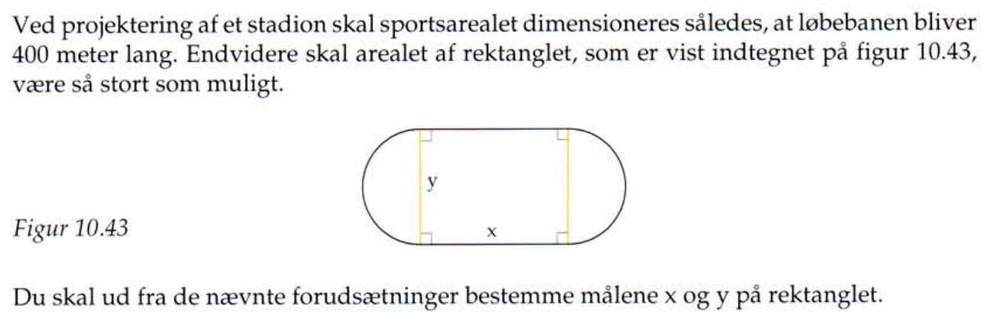
*** A-hus
#+attr_html: :width 100%
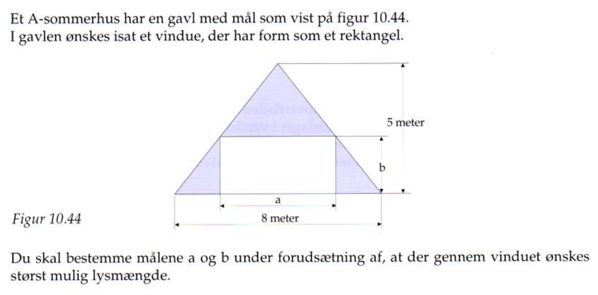
*** Bro
#+attr_html: :width 100%
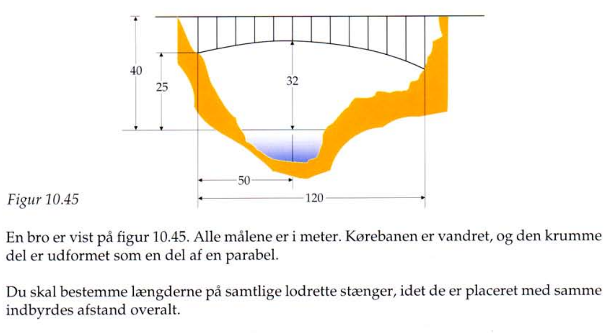
* Hyperblen

** Hyperblens koefficienter
#+reveal_html: 

#+begin_export html
<iframe
width="600"
height="400"
src="./ggb/hyperblens_koefficienter.html"
title=""
frameborder="0">
</iframe>
#+end_export
#+reveal_html: 

#+reveal_html: 

#+reveal_html: 

Udgangspunktet er den simpleste hyperbel, man kan forestille sig, nemlig
$$f(x)=\frac{1}{x}$$
Men hvis forskriften i stedet er
$$\boxed{f(x)=\frac{k}{x-a}+b}$$
hvilken indvirkning af har så $k$, $a$ og $b$ på grafen?
#+reveal_html: 

** Simple opgaver
#+reveal_html: 

#+reveal_html: 

Link til opgaven i matematikbogen: [[https://matbhtx.systime.dk/?id=c13709]]
#+attr_html: :width 85%
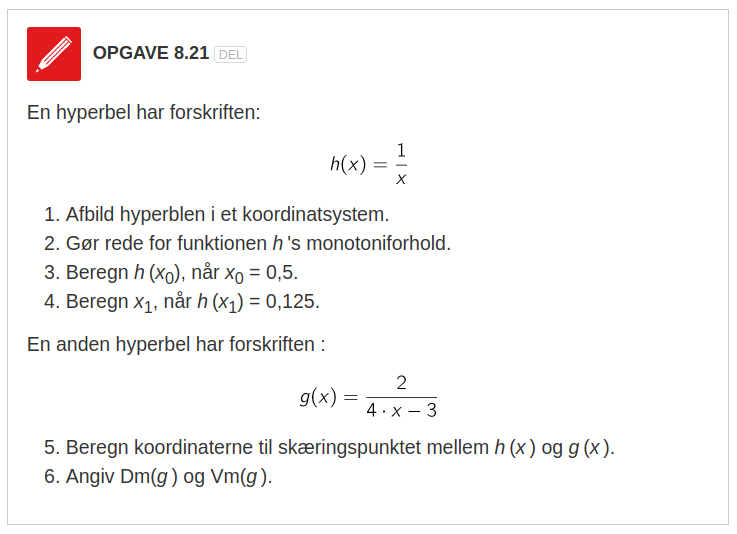
#+reveal_html: 

#+reveal_html: 

Link til opgaven i matematikbogen: [[https://matbhtx.systime.dk/?id=c13710]]
#+attr_html: :width 85%
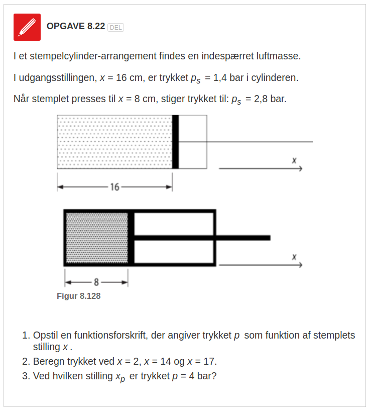
#+reveal_html: 

** Den afledte funktion
#+reveal_html: 

#+reveal_html: 

Vi tager lige udgangspunkt i den simple hyperbel
$$f(x)=\frac{1}{x}$$

Den kan I godt selv finde den afledte funktion af. *Gør lige det!*

#+attr_reveal: :frag (appear)
\begin{align*}
f(x) &= \frac{1}{x} \\
f(x) &= x^{-1} \to \\
f'(x) &= -1 \cdot x^{-2} \\
f'(x) &= - \frac{1}{x^2}
\end{align*}
#+reveal_html: 

#+reveal_html: 

#+attr_reveal: :frag (appear)
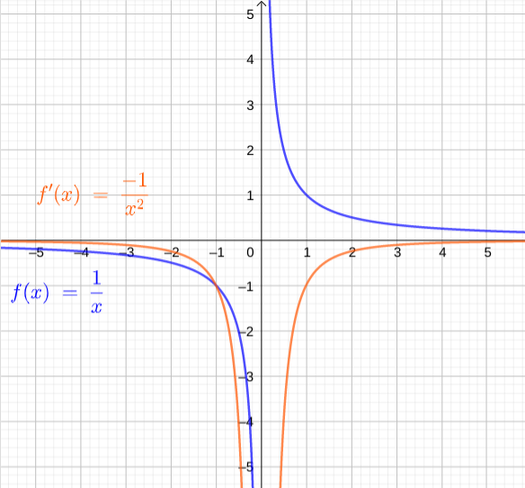
#+reveal_html: 

** Stamfunktionen
#+reveal_html: 

Vi tager lige udgangspunkt i den simple hyperbel
$$f(x)=\frac{1}{x}$$
#+attr_reveal: :frag (appear)
- Det naive forsøg er at omskrive
  $$f(x)=x^{-1}$$
- Kan man ikke finde stamfunktionen nu?
  $$f(x)=x^n \to F(x) = \frac{x^{n+1}}{n+1}+k$$
- *Prøv lige at gøre det!*
- /Hvad er problemet?/

#+reveal: split
*Den rigtige stamfunktion*
#+reveal_html: 

Ifølge tabeller er den *rigtige* stamfunktion
$$f(x)=\frac{1}{x}$$
$$\boxed{ F(x) = \ln (x) +(k)}$$

#+attr_reveal: :frag (appear)
- Men hvad er $\ln(x)$ egentlig for noget?
- Kan det være rigtigt?

#+reveal: split
*Undersøgelse af $\ln(x)$*

#+reveal_html: 

#+begin_export html
<iframe
width="600"
height="400"
src="./ggb/hyperbel_stamfunktion.html"
title=""
frameborder="0"
allowfullscreen>
</iframe>
#+end_export

#+reveal_html: 

#+reveal_html: 

#+reveal_html: 

Lad os undersøge /hældningen/ for $\ln(x)$.
- Tryk på =Tangent= og se, hvad I kan gøre.
- Tryk på =Tangenthældning= for at få /hældningen/ til tangenten som funktion af x.
- Tryk på =???= og se, hvad der sker.
#+attr_reveal: :frag (appear)
- Arhh, hvis den /afledte funktion/ af $\ln(x)$ er lig $\frac{1}{x}$, så må /stamfunktionen/ til $\frac{1}{x}$ være lig $\ln(x)$.
- Altså:
  \begin{align*}
  f(x)=\frac{1}{x} \\
  F(x)= \int \frac{1}{x}\,dx \\
  \boxed{F(x) = \ln(x)+(k)}
  \end{align*}
#+reveal_html: 

#+reveal: split
#+reveal_html: 

*Konklusion*

For den simple hyperbel
$$f(x)=\frac{1}{x}$$
er den /afledte funktion/
$$f'(x) = - \frac{1}{x^2}$$
mens /stamfunktionen/ er
$$F(x) = \ln(x) +(k)$$
** Gabriels horn 
#+reveal_html: 

#+reveal_html: 

#+reveal_html: 

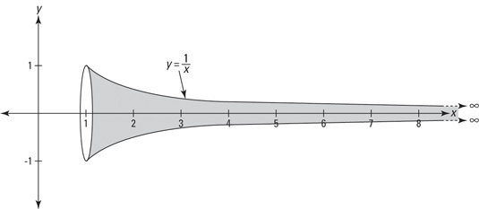
#+reveal_html: 

** Nu skal I se noget interessant
#+reveal_html: 

video med numberphile
#+begin_export html
<iframe width="600" height="400" src="https://www.youtube.com/embed/yZOi9HH5ueU" title="YouTube video player" frameborder="0" allow="accelerometer; autoplay; clipboard-write; encrypted-media; gyroscope; picture-in-picture" allowfullscreen></iframe>
#+end_export

** Opsummering
#+attr_html: :height 500px
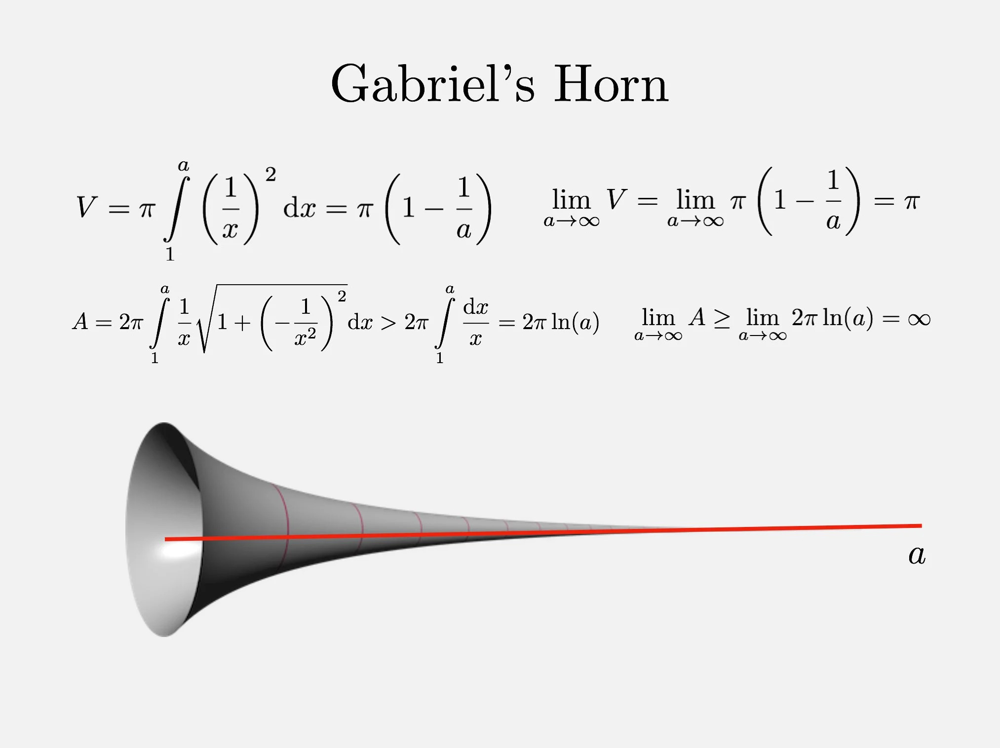
* Omdrejningslegemer
#+attr_html: :height 500px
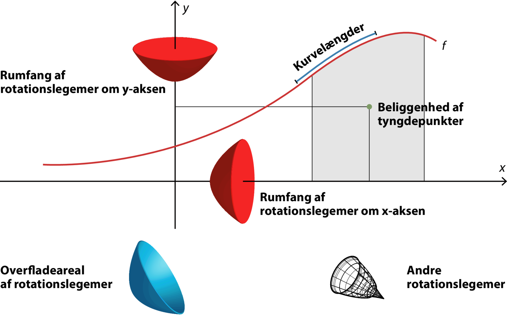
** Drejning om x-aksen
#+reveal_html: 

#+reveal_html: 

*Volumen*

$$V_x = \int_{x_1}^{x_2} \pi \cdot f(x)^2 \, dx$$

*Overfladeareal*

$$\text{Areal} = 2 \pi \int_{x_1}^{x_2} f(x)\cdot \sqrt{1+f'(x)^2} \, dx$$
#+reveal_html: 

#+reveal_html: 

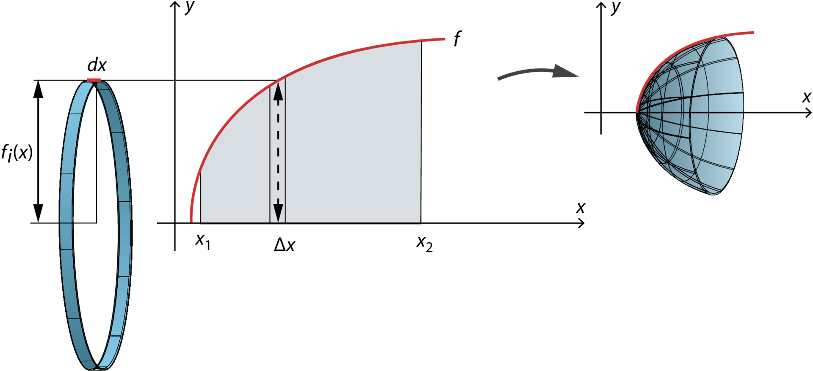
#+reveal_html: 

** Drejning om y-aksen
#+reveal_html: 

#+reveal_html: 

*Volumen*

$$V_y = 2 \pi \int_{x_1}^{x_2} f(x) \cdot x \, dx$$
#+reveal_html: 

#+reveal_html: 

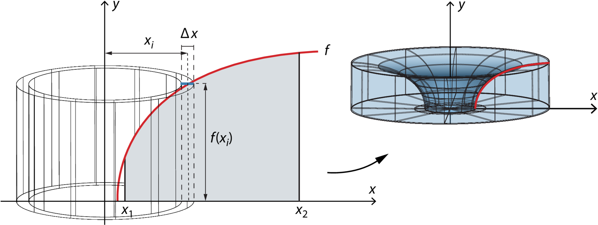
#+reveal_html: 

** Opgave
#+reveal_html: 

Bestem rumfanget af den kegle, der fremkommer, når følgende funktion roteres omkring x-aksen mellem 0 og 6:

$$f(x) = \frac{1}{3}x$$

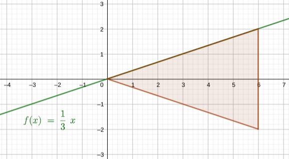
* Potensfunktioner
#+reveal_html: 

#+reveal_html: 

Den generelle forskrift

$$f(x)= b \cdot x^a$$

Leg med skyderne. *Hvad ser I*?

#+begin_export html
<iframe
width="600"
height="400"
src="./ggb/potensfunktioner.html"
title="Potensfunktioner"
frameborder="0">
</iframe>
#+end_export
#+reveal_html: 

#+reveal_html: 

Hvad er forskellen på om $a$ er:
- heltallig eller et decimaltal?
- et lige eller et ulige tal?
- negativ eller positiv?
#+reveal_html: 

** Lige og ulige (potens)funktioner

** Lige funktioner
#+reveal_html: 

#+reveal_html: 

For en lige funktion gælder det (altid), at
- $f(x)=f(-x)$
- Altså spejlingssymmetrisk om y-aksen.

- Hvad skal der gælde for $a$ og $b$, for at få de forskellige grafer til højre?

#+reveal_html: 

#+reveal_html: 

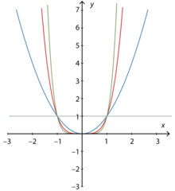

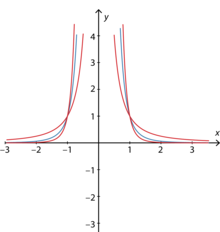
#+reveal_html: 

** Ulige funktioner
#+reveal_html: 

#+reveal_html: 

For en ulige funktion gælder det (altid), at
- $f(x)=-f(-x)$
- skal altså spejles om y-aksen *og* x-aksen.

- Hvad skal der gælde for $a$ og $b$, for at få de forskellige grafer til højre?
#+reveal_html: 

#+reveal_html: 

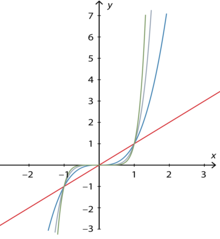
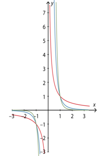
#+reveal_html: 

** Dm og vm
#+reveal_html: 

#+reveal_html: 

Hvad er Dm og Vm for følgende a-værdier?

(I må gerne bruge appletten fra tidligere.)

- Lige, positiv og heltallig
- Lige, negativ og heltallig
- Ulige, postiv og heltallig
- Ulige, nagativ og heltallig

Hvad er ændringen, når $a$ er et decimaltal?
#+reveal_html: 

#+reveal_html: 

#+begin_export html
<iframe
width="600"
height="400"
src="./ggb/potensfunktioner.html"
title="Potensfunktioner"
frameborder="0">
</iframe>
#+end_export

#+reveal_html: 

** Opgaver
[[https://matbhtx.systime.dk/?id=c13715]]

#+attr_html: :width 800px
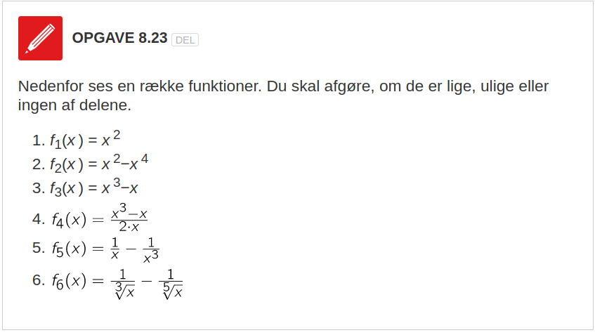

* Polynomier
** Det generelle polynomium
#+reveal_html: 

\begin{align*}
f(x)&= \sum_{i=0}^{i=n} a_i \cdot x^{i} \quad \text{for } n \in \mathbb{Z} \setminus \mathbb{Z}_- \\
f(x)&= a_0 + a_1\cdot x + a_2\cdot x^2+ \dots + a_{n-1}\cdot x^{n-1} + a_n \cdot x^n
\end{align*}
Eller
$$\boxed{f(x)= a_n \cdot x^n + a_{n-1}\cdot x^{n-1}+ \dots + a_2 \cdot x^2 + a_1 \cdot x + a_0}$$
- $n$ kan altså kun være de /naturlige/ tal samt nul (alle positive hele tal samt nul.
- Er en sum af en række potensfunktioner.
** Eksempler
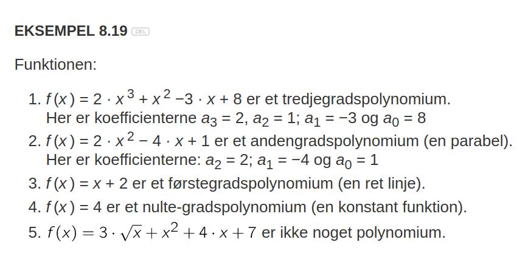

#+reveal: split
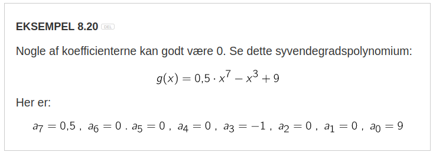
** Opgaver
https://matbhtx.systime.dk/?id=c13716

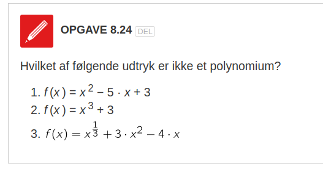
** Rødder (nulpunkter)
#+reveal_html: 

#+begin_quote
Algebraens fundamentalsætning:

- Ethvert polynomium, $p(z)$, af n'te grad med $n\geq 1$ har $n$ komplekse rødder, $z_1$, $z_2$, $\dots$, $z_n$, (som ikke nødvendigvis er forskellige).
- Polynomiet kan faktoriseres som
  $$p(z) = a_n \cdot \left( z-z_1 \right)\cdot \left( z - z_2 \right) \cdots \left( z-z_n \right)$$
#+end_quote

Men dette gælder for /komplekse/ tal. Hvad med de /reelle/ tal?

#+reveal: split
#+reveal_html: 

#+reveal_html: 

*Reelle rødder for et polynomium*
- Hvis polynomiegraden er ulige, er der generelt mindst én rod.
- Hvis polynomiegraden er lige, er der ingen garanti for en rod.
- Der kan maksimalt være $n$ rødder for et n'te-gradspolynomium.
- Det er /nemt/ at finde rødderne til 1. og 2. grad. Vi kender allerede formlerne.
- Det er /muligt/ at finde rødderne til 3. og 4. grad, med meget besværlige formler.
- Der er /ingen generelle/ formler til bestemmelse af rødder for 5. grad og opefter.
- Rødderne findes vha /numeriske/ metoder.
#+reveal_html: 

#+reveal_html: 

#+attr_html: :width auto :height 650px
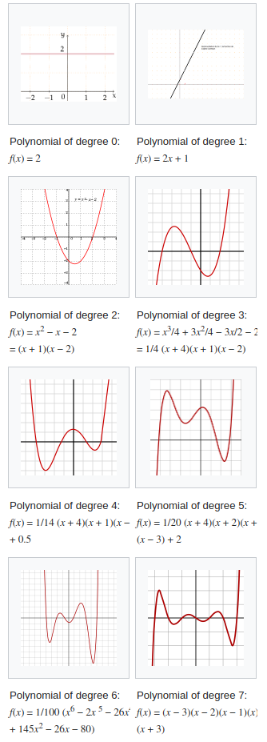
#+reveal_html: 

** Opgave
https://matbhtx.systime.dk/?id=c13717

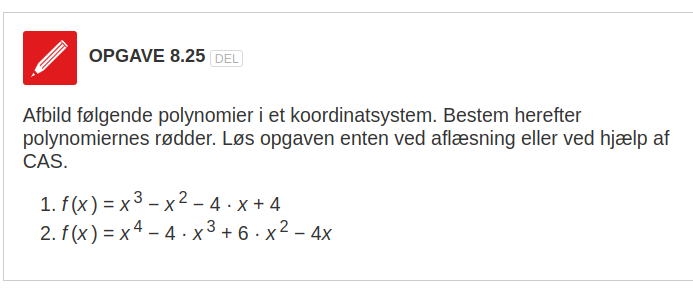

** Kurvetilpasning - opgave
#+reveal_html: 

#+reveal_html: 

*Hvad er rumfanget af denne flaske?*

Flasken er 18.8 cm høj.

I må bruge alle matematiske hjælpemidler.

#+attr_reveal: :frag (appear)
- Okay, hvis du fik at vide, du havde en dag tilbage at +leve+ regne i. *Hva' ville du så gøre?*
- *Hva' jeg ville gøre?*
- Jeg tror, jeg ville...
- +Hæve lidt penge på min firmakonto...+
- Indsætte billedet af flasken i =geogebra=
- Skalere billedet, så højden af flasken passer med inddelingen af akserne
- Lægge flasken ned symmetrisk langs x-aksen
- Indsætte en række punkter langs flaskens profil
- Fitte et polynomium til punkterne
- Bruge integralregning (omdrejningslegeme om x-aksen) til at bestemme rumfanget
#+reveal_html: 

#+reveal_html: 

#+reveal_html: 

** En dag tilbage
[[https://youtu.be/_JgbyISzmjQ][file:./img/nik_og_jay_en_dag_tilbage.png]]
* Sammensatte funktioner
#+attr_html: :width 50%

** Det grundlæggende
#+reveal_html: 

#+attr_reveal: :frag (appear)
- Hvis man har flere funktioner, kan man sætte dem ind i hinanden, og så har man...
- drum roll!
- sammensatte funktioner!

#+attr_reveal: :frag (appear)
F.eks. $$f(x)= x^2 \quad,\quad g(x)=\sin(x) \quad,\quad h(x)=10^x$$
#+reveal_html: 

#+attr_reveal: :frag (appear)
- Kan blive til
  \begin{align*}
  f(g(x))&= \left( \sin(x) \right)^2 \\
  h(f(x))&= 10^{\left(x^2\right)}
  \end{align*}
#+reveal_html: 

#+reveal_html: 

#+attr_reveal: :frag (appear)
- mens
  \begin{align*}
  g(f(x))&= \sin \left(x^2  \right) \\
  f(h(x))&= \left( 10^x \right)^2
  \end{align*}
#+reveal_html: 

** Opgaver
#+reveal_html: 

For funktionerne
\begin{align*}
f(x)&=x^3 & g(x)&= 2\cdot x +5 \\
h(x)&= \sqrt{x+8} & i(x)&= \cos(x)
\end{align*}
Find da de sammensatte funktioner:
\begin{align*}
&f(g(x)) \\
&i(h(x)) \\
&h(f(x)) \\
&i(f(h(g(x))))
\end{align*}

** Differentiation af sammensatte funktioner
#+attr_html: :width 50%

** Kædereglen
#+reveal_html: 

Hvis man skal differentiere en sammensat funktion, skal man anvende /kædereglen/, som siger:
#+begin_quote
For den sammensatte funktion $f(x)=g(h(x))$ gælder, at
$$\boxed{f'(x) = g'(h(x))\cdot h'(x) = \frac{d g(h(x))}{d h(x)}\cdot \frac{d h(x)}{dx}}$$
#+end_quote

#+attr_reveal: :frag (appear)
- Men hvad søren skal det nu betyde?
- Jo, det skal læses som:
- Først differentierer man den /ydre/ funktion (mht den indre funktion) og lader den /indre/ funktion stå.
- Herefter differentierer man den /indre/ funktion (mht x), og dette /multiplicerer/ man på det første differentiale.
- Vi må hellere tage nogle eksempler.
  
** Eksempel
#+reveal_html: 

$$f(x)=\left( 2\cdot x^3+5x \right)^4$$
#+attr_reveal: :frag (appear)
- Den ydre funktion er $g(x)=x^4$
- Den indre funktion er $h(x)=2\cdot x^3 + 5x$
- Først finder man $g'(x)=4 x^3$, men på x's plads skriver man den indre funktion, altså
- $g'(h(x))=4 \cdot \left( 2\cdot x^3+5x \right)^3$
- Så differentierer man den indre funktion på alm. vis
- $h'(x) = 2 \cdot 3 \cdot x^2+5 = 6x^2+5$
- men dette skal lige ganges på det første, altså
- $$f'(x) = g'(h(x))\cdot h'(x) = 4 \cdot \left( 2\cdot x^3+5x \right)^3 \cdot \left( 6x^2+5 \right)$$

** Et andet eksempel
#+reveal_html: 

Vi gør det lige en gang til (Den er lidt svær).
$$f(x) = \sqrt{\left( 4x^3 + 1 -2x \right)^2-6x^2}$$

$$f'(x) = \frac{1}{2} \cdot \left( \left(4x^3+1-2x \right)^2-6x^2\right)^{- \frac{1}{2}}\cdot \left( 2\left(4x^3+1-2x  \right)\cdot \left( 4 \cdot 3 x^2-2 \right) - 6 \cdot 2 x \right)$$

hvor det er brugt, at
\begin{align*}
\frac{d}{dx} \left( \sqrt{x} \right) &= \frac{1}{2}x^{- \frac{1}{2}} = \frac{1}{2 \sqrt{x}} \\
\frac{d}{dx} \left(\left( 4x^3+1-2x \right)^2-6x^2  \right) &= \frac{d}{dx}\left( \left(4x^3+1-2x \right)^2\right) - \frac{d}{dx} \left( 6x^2 \right) = \frac{d}{dx}\left( \left(4x^3+1-2x \right)^2\right) -  6\cdot 2x \\
\frac{d}{dx} \left( \left(4x^3+1-2x \right)^2 \right)  &= 2 \left( 4x^3+1-2x \right) \cdot \left( 4 \cdot 3 x^2-2 \right)
\end{align*}

** Opgaver
#+reveal_html: 

Bestem de afledte funktioner for de følgende sammensatte funktioner.

\begin{align*}
f(x) &= \left( x^2+3x-1 \right)^3 \\
g(x) &= \left( 3x-4 \right)^5 \\
h(x) &= \left( \frac{5}{2x}+4 \right)^4 \\
i(x) &= 3 \cdot \sqrt{ \left( 1 -x^2 \right)^5}
\end{align*}

* Projekt Skatepark
#+reveal_html: 

#+attr_html: :width 400px
[[./Projekt_skatepark_diff_og_int.pdf][file:img/skatepark_1.png]]

- I kan klikke på billedet for at åbne projektoplægget.
- Eller I kan højreklikke og gemme som.
