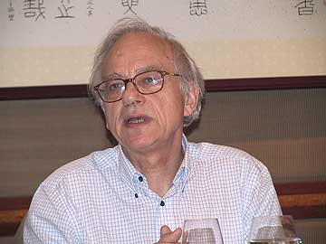
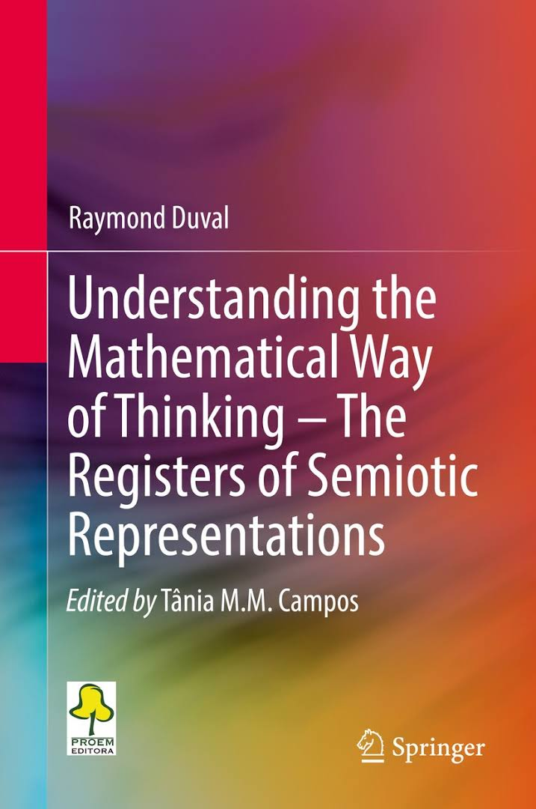
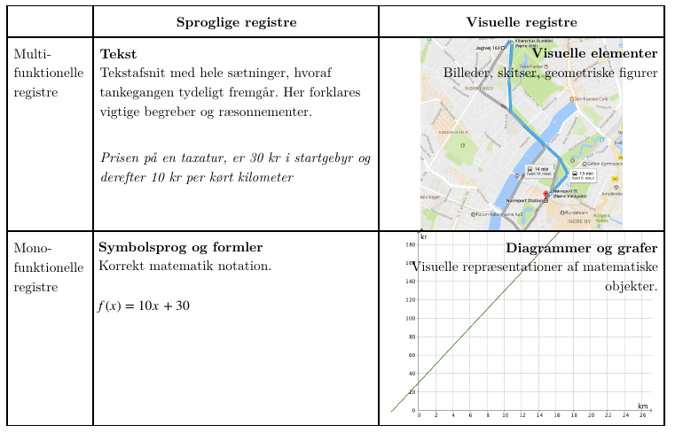
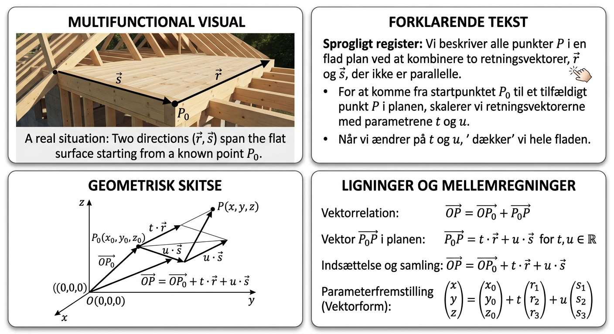
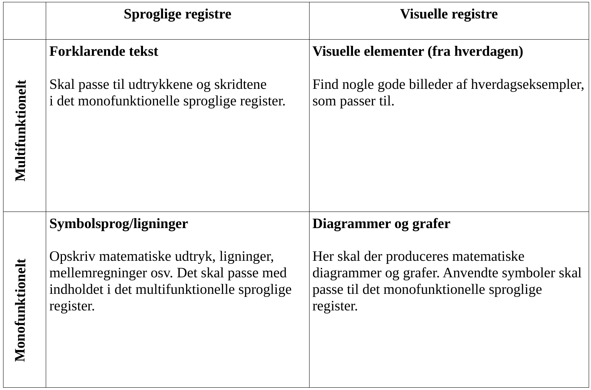

#+title: Beviser
#+subtitle: Vektorer i rummet
#+author: Jacob Debel
#+date: 
# Themes: beige|black|blood|league|moon|night|serif|simple|sky|solarized|white
#+reveal_theme: night
#+reveal_title_slide: <h2>%t</h2><h3>%s</h3><h4>%a</h4><h4>%d</h4>
#+reveal_title_slide_background:
#+reveal_default_slide_background:
#+reveal_extra_options: slideNumber:"c",progress:true,transition:"slide",navigationMode:"default",history:false,hash:true
# #+reveal_extra_attr: style="color:red"
#+options: toc:nil num:nil tags:nil timestamp:nil ^:{}

* Raymond Duval

#+attr_html: :height 300px

Den franske filosof og psykolog Raymond Duval har siden 1970'erne forsket i matematikdidaktik.
** 
#+attr_html: :height 600px

* 4 registre

#+reveal_html: 

*Det multifunktionelle sproglige register*

benytter sig af det naturlige sprog (hverdagssprog) til at beskrive objekter, udsagn og situationer. Altså hverdagssprog til at beskrive noget.

*Det monofunktionelle sproglige register*

anvender det matematiske symbolsprog, altså tal, ligninger, tegn og algebraiske udtryk.

*Det multifunktionelle visuelle register*

indeholder figurer, tegninger og billeder fra virkeligheden.
 
*Det monofunktionelle visuelle register*

indeholder matematisk information i form af f.eks. grafer og diagrammer.
#+reveal_html: 

** 

#+attr_html: :width 100%

** Planens parameterfremstilling - Gemini

* Jeres tur
#+reveal_html: 

- Grupper af 3.
- Alle hjælper alle. 
- Ansvarspersoner:
  - Monofunktionelt sprogligt: Højeste husnummer
  - Multifunktionelt sprogligt: Kortest transporttid til skole
  - Mono- og multifunktionelt visuelt: Den der er tilbage
- Skift ansvar for hvert bevis.
#+reveal_html: 

** Beviser/udledninger
#+reveal_html: 

#+reveal_html: 

#+reveal_html: 

- *Need to have*
  - Linjens parameterfremstilling
  - Planens parameterfremstilling
  - Planens ligning på normalform
  - Afstand mellem punkt og linje
  - Afstand mellem punkt og plan
  - Vinkel mellem linje og plan
- *Nice to have*
  - Længde af vektor i rummet
  - Enhedsvektor
  - Projektion af vektor på vektor
  - Vinkel mellem to vektorer
  - Vindskæve linjer
  - Tjek om punkt er på linje
  - Tjek om punkt er i plan
  - Skæringspunkt mellem linje og plan
  - Vinkel mellem linjer
  - Vinkel mellem planer
  - Afstand mellem to planer
  - Afstand mellem to linjer
- *En ekstra udfordring*
  - Krydsprodukt
  - Skalarprodukt
#+reveal_html: 

#+reveal_html: 

#+reveal_html: 

#+reveal_html: 

- Brug mine noter og videoer samt jeres matematikbog til at blive klogere på udledningerne.
- *I skal producere alt selv til jeres egne udledninger/beviser.*
- Jeg har ekstra dokumenter til krydsprodukt og skalarprodukt, hvis I vil arbejde med det.
#+reveal_html: 

#+reveal_html: 

#+reveal_html: 

